# Linear Regression Implementation Documentation

> A comprehensive guide bridging theory from *An Introduction to Statistical Learning* (ISL) and *The Elements of Statistical Learning* (ESL) with a practical NumPy-based implementation.

---

## 1. Introduction

### What is Linear Regression?

Linear regression is a supervised learning method for modeling the relationship between a quantitative response variable $Y$ and one or more predictor variables $X_1, X_2, \dots, X_p$. It assumes that this relationship can be approximated by a linear function of the predictors.

**Reference:**

> Book: ISL  
> Chapter: 3 - Linear Regression  
> Section: 3.1 Simple Linear Regression  
> Pages: 70  

> Book: ESL  
> Chapter: 3 - Linear Methods for Regression  
> Section: 3.1 Introduction  
> Pages: 43  

### Why Linear Regression is Important in Machine Learning

Linear regression is foundational to statistical learning for several reasons:

- It is **simple, interpretable, and fast** to train.
- It often provides **adequate predictive performance**, especially when the signal-to-noise ratio is low or training data is sparse (ESL, p. 43).
- Many advanced methods (e.g., splines, GAMs, neural networks) are generalizations of linear regression (ISL, p. 69; ESL, p. 43).
- It serves as a **baseline model** against which more complex approaches are compared.

**Reference:**

> Book: ESL  
> Chapter: 3 - Linear Methods for Regression  
> Section: 3.1 Introduction  
> Pages: 43  

### Prediction vs. Inference

Linear regression serves two distinct goals:

| Goal | Description |
|------|-------------|
| **Prediction** | Use $X$ to forecast $Y$ for new observations. Model accuracy is measured by test error. |
| **Inference** | Understand how $Y$ changes as $X$ changes. Focus is on coefficient estimates, confidence intervals, and hypothesis tests. |

**Reference:**

> Book: ISL  
> Chapter: 2 - Statistical Learning  
> Section: 2.1.1 Why Estimate f?  
> Pages: 17-19  

### Purpose of This Implementation

The implementation provides a from-scratch linear regression toolkit using only NumPy. It includes:

- **Normal Equation** (closed-form solution via matrix algebra)
- **Batch, Stochastic, and Mini-Batch Gradient Descent** (iterative optimization)
- **Model diagnostics** (residual analysis, leverage, Cook's distance, VIF)
- **Assumption testing** (linearity, independence, homoscedasticity, normality)
- **Evaluation metrics** (MAE, MSE, RMSE, R$^2$)

### How the Algorithm Works at a High Level

1. **Specify the model**: $Y = X\beta + \varepsilon$
2. **Choose a cost function**: Residual Sum of Squares (RSS)
3. **Optimize**: Find $\hat{\beta}$ that minimizes RSS via either:
   - **Normal Equation** (direct matrix inversion)
   - **Gradient Descent** (iterative parameter updates)
4. **Predict**: $\hat{y} = X\hat{\beta}$
5. **Evaluate**: Compare $\hat{y}$ against true $y$ using evaluation metrics.

---

## 2. Mathematical Foundation

### 2.1 Linear Regression Model

#### Simple Linear Regression

For a single predictor $X$ and response $Y$, the model is:

$$Y \approx \beta_0 + \beta_1 X \tag{3.1}$$

where:

- $Y$ is the **response** (target) variable
- $X$ is the **predictor** (feature) variable
- $\beta_0$ is the **intercept** (value of $Y$ when $X=0$)
- $\beta_1$ is the **slope** (average change in $Y$ per unit change in $X$)

The estimated version used for prediction is:

$$\hat{y} = \hat{\beta}_0 + \hat{\beta}_1 x \tag{3.2}$$

**Reference:**

> Book: ISL  
> Chapter: 3 - Linear Regression  
> Section: 3.1 Simple Linear Regression  
> Pages: 70-71  

#### Multiple Linear Regression

For $p$ predictors:

$$Y = \beta_0 + \beta_1 X_1 + \beta_2 X_2 + \dots + \beta_p X_p + \varepsilon \tag{3.19}$$

In matrix form:

$$y = X\beta + \varepsilon$$

where:

- $y$ is the $n \times 1$ vector of responses
- $X$ is the $n \times (p+1)$ **design matrix** (first column is 1s for intercept)
- $\beta$ is the $(p+1) \times 1$ vector of parameters
- $\varepsilon$ is the $n \times 1$ vector of errors

**Reference:**

> Book: ISL  
> Chapter: 3 - Linear Regression  
> Section: 3.2 Multiple Linear Regression  
> Pages: 80-81  

> Book: ESL  
> Chapter: 3 - Linear Methods for Regression  
> Section: 3.2 Linear Regression Models and Least Squares  
> Pages: 44  

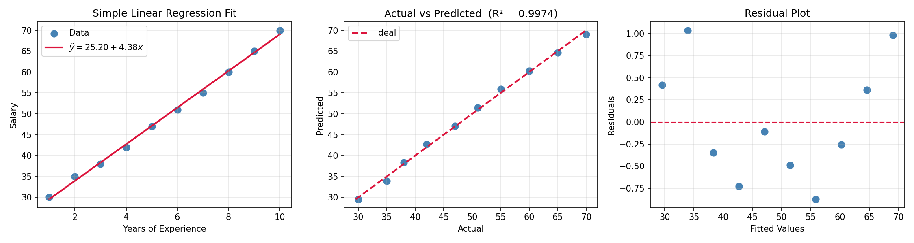
*Left: Regression line fitted to salary data with residuals shown as gray segments. Center: Actual vs. predicted values cluster tightly around the ideal line ($R^2 = 0.997$). Right: Residual plot shows random scatter around zero, supporting the linearity assumption.*

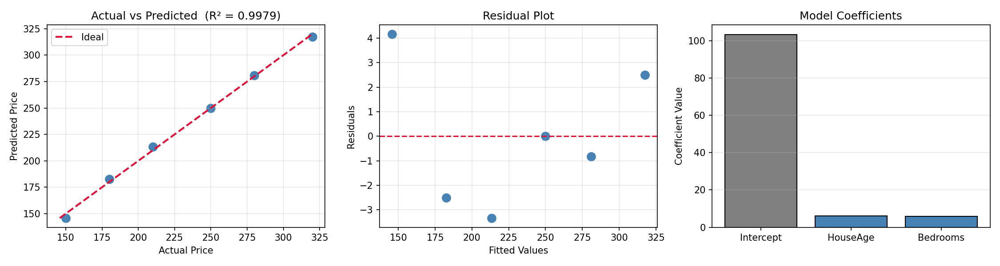
*Left: Actual vs. predicted house prices ($R^2 = 0.998$). Center: Residuals show no systematic pattern. Right: Coefficient magnitudes reveal HouseAge has the largest effect on price.*

#### Connection to Implementation

In `02_multiple_linear.py`, the design matrix is constructed as:

```python
X = np.column_stack((np.ones(len(x1)), x1, x2))
```

The first column of ones corresponds to the intercept $\beta_0$. Each additional column holds the predictor values. The coefficient vector is:

```python
beta = np.linalg.solve(X.T @ X, X.T @ y)
```

### 2.2 Residuals and Errors

The **residual** for the $i$-th observation is the difference between the observed and predicted values:

$$e_i = y_i - \hat{y}_i$$

The **error** $\varepsilon_i$ is the unobserved deviation of $Y_i$ from the true regression function $f(X_i) = X_i\beta$:

$$\varepsilon_i = y_i - X_i\beta$$

While errors are theoretical and unobserved, residuals are computable from the fitted model.

**Why minimizing residuals is important:** The least squares criterion chooses $\beta$ to make the residuals as small as possible in the Euclidean norm sense, yielding the best linear unbiased estimator (Gauss-Markov theorem).

#### Intuition: Residuals vs. Errors with a Concrete Example

Consider a simple model predicting **House Price** from **House Size (sq ft)**:

| $i$ | Size ($X$) | True Price ($Y$) | True Model: $200X + 50{,}000$ | Observed Error $\varepsilon_i$ | Fitted Model: $190X + 55{,}000$ | Residual $e_i$ |
|-----|-------------|------------------|-------------------------------|-------------------------------|----------------------------------|----------------|
| 1 | 1,000 | 255,000 | 250,000 | +5,000 | 245,000 | +10,000 |
| 2 | 1,500 | 340,000 | 350,000 | -10,000 | 340,000 | 0 |
| 3 | 2,000 | 460,000 | 450,000 | +10,000 | 435,000 | +25,000 |

- **Errors** $\varepsilon_i$ are the deviations from the *true* (unknowable) model. They are never observed in practice.
- **Residuals** $e_i$ are the deviations from the *fitted* model. They are directly computable.
- Fitting minimizes $\sum e_i^2$ (not $\sum \varepsilon_i^2$), making residuals small proxies for the unobserved errors.

**Reference:**

> Book: ISL  
> Chapter: 3 - Linear Regression  
> Section: 3.1.1 Estimating the Coefficients  
> Pages: 71-72  

> Book: ESL  
> Chapter: 3 - Linear Methods for Regression  
> Section: 3.2 Linear Regression Models and Least Squares  
> Pages: 44-45

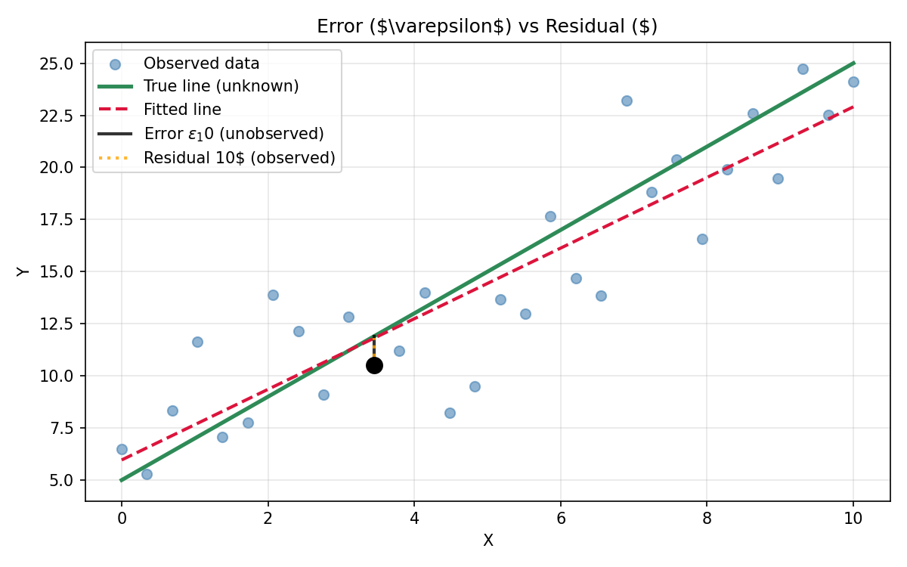
*The black line is the true (unobserved) DGP; the dashed crimson line is the fitted model. The black vertical bar shows an unobserved error $\varepsilon_i$; the orange vertical bar shows the observed residual $e_i$. Only residuals are available for diagnostics.*  

### 2.3 Loss Function

#### Residual Sum of Squares (RSS)

$$RSS = \sum_{i=1}^{n} (y_i - \hat{y}_i)^2 = \sum_{i=1}^{n} (y_i - \hat{\beta}_0 - \hat{\beta}_1 x_{i1} - \dots - \hat{\beta}_p x_{ip})^2 \tag{3.3, ISL}$$

In matrix form:

$$RSS(\beta) = (y - X\beta)^T (y - X\beta) \tag{3.3, ESL}$$

**Reference:**

> Book: ISL  
> Chapter: 3 - Linear Regression  
> Section: 3.1.1 Estimating the Coefficients  
> Pages: 71  

> Book: ESL  
> Chapter: 3 - Linear Methods for Regression  
> Section: 3.2 Linear Regression Models and Least Squares  
> Pages: 44-45  

#### Mean Squared Error (MSE)

$$MSE = \frac{1}{n} \sum_{i=1}^{n} (y_i - \hat{y}_i)^2 = \frac{RSS}{n}$$

**Why this function is optimized:** Under the assumption that errors are independent and identically distributed with mean zero, minimizing RSS is equivalent to maximum likelihood estimation when errors are normally distributed (ESL, p. 47). The MSE scales RSS to be independent of sample size, making it comparable across datasets.

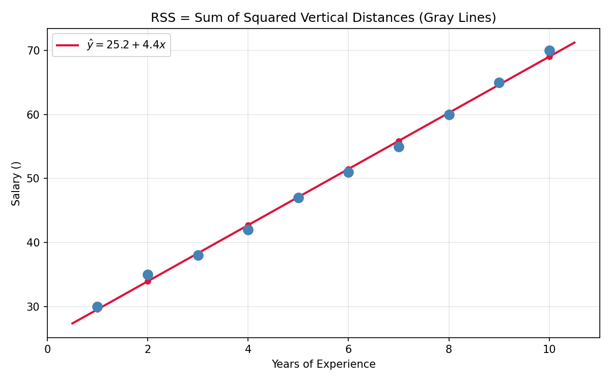
*RSS is the sum of squared lengths of the gray vertical dashed lines connecting each observed data point to the fitted regression line. The OLS solution chooses $\hat{\beta}$ to minimize this total squared distance.*

**Reference:**

> Book: ESL  
> Chapter: 3 - Linear Methods for Regression  
> Section: 3.2 Linear Regression Models and Least Squares  
> Pages: 44-47

---

## 3. Linear Regression Rules and Assumptions

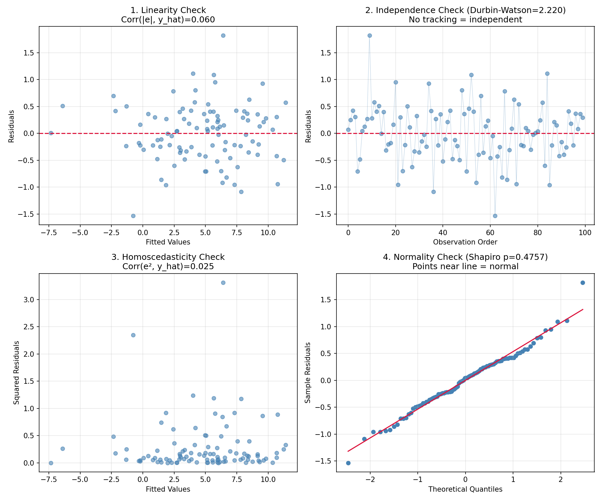
*Four diagnostic plots from `08_assumptions.py`: (1) Residuals vs. fitted tests linearity -- no pattern indicates the assumption holds. (2) Residuals indexed by observation order test independence. (3) Squared residuals vs. fitted test homoscedasticity. (4) Q-Q plot tests normality of errors. All checks pass for this well-specified synthetic dataset.*

### 3.1 Linearity

**Definition:** The relationship between each predictor $X_j$ and the response $Y$ is linear in the parameters.

**Mathematical meaning:** $E(Y|X) = \beta_0 + \beta_1 X_1 + \dots + \beta_p X_p$. The model is a linear combination of the parameters.

**Why it matters:** If the true relationship is non-linear, the model will systematically under- or over-predict in certain regions, yielding biased estimates and poor predictions.

**How to test it:** Plot residuals $\hat{e}_i$ versus fitted values $\hat{y}_i$. A U-shaped or patterned scatter indicates non-linearity (ISL, p. 100-101).

**What happens if violated:** Coefficients become biased estimates of the true relationship; prediction accuracy degrades.

**Reference:**

> Book: ISL  
> Chapter: 3 - Linear Regression  
> Section: 3.3.3 Potential Problems (1. Non-linearity of the Data)  
> Pages: 100-101  

> Book: ESL  
> Chapter: 3 - Linear Methods for Regression  
> Section: 3.2 Linear Regression Models and Least Squares  
> Pages: 44  

**Implementation check (`08_assumptions.py`):**

```python
corr_fitted_absres = np.corrcoef(y_pred, np.abs(residuals))[0, 1]
# |corr| < 0.3 suggests no pattern -> linearity holds
```

### 3.2 Independence

**Definition:** The error terms $\varepsilon_1, \varepsilon_2, \dots, \varepsilon_n$ are uncorrelated with each other.

**Mathematical meaning:** $\text{Cov}(\varepsilon_i, \varepsilon_j) = 0$ for $i \neq j$.

**Why it matters:** Correlated errors cause standard errors to be underestimated, producing misleading confidence intervals and p-values (ISL, p. 101).

**How to test it:** For time series data, use the Durbin-Watson test. Values near 2 indicate no autocorrelation; values near 0 or 4 indicate positive or negative autocorrelation.

**What happens if violated:** Confidence intervals are too narrow; hypothesis tests have inflated Type I error rates.

**Reference:**

> Book: ISL  
> Chapter: 3 - Linear Regression  
> Section: 3.3.3 Potential Problems (2. Correlation of Error Terms)  
> Pages: 101-102  

**Implementation check (`08_assumptions.py`):**

```python
diff = np.diff(residuals)
dw = np.sum(diff ** 2) / np.sum(residuals ** 2)
# 1.5 < DW < 2.5 suggests no autocorrelation
```

### 3.3 Constant Variance (Homoscedasticity)

**Definition:** The error terms have constant variance across all levels of the predictors.

**Mathematical meaning:** $\text{Var}(\varepsilon_i) = \sigma^2$ for all $i = 1, \dots, n$.

**Why it matters:** Heteroscedasticity (non-constant variance) invalidates standard error calculations, confidence intervals, and hypothesis tests (ISL, p. 103).

**How to test it:** Plot residuals versus fitted values. A funnel shape (increasing spread) indicates heteroscedasticity. Alternatively, test correlation between fitted values and squared residuals.

**What happens if violated:** Standard errors are biased; inference is unreliable. Weighted least squares or response transformation (e.g., $\log Y$) can help.

**Reference:**

> Book: ISL  
> Chapter: 3 - Linear Regression  
> Section: 3.3.3 Potential Problems (3. Non-constant Variance of Error Terms)  
> Pages: 103  

### 3.4 Normality of Errors

**Definition:** The error terms are normally distributed with mean zero.

**Mathematical meaning:** $\varepsilon_i \sim N(0, \sigma^2)$.

**Why it matters:** Normality is required for exact finite-sample inference ($t$-tests, $F$-tests, confidence intervals). In large samples, the central limit theorem provides approximate normality for coefficient estimates even when errors are non-normal (ESL, p. 48-49).

**How to test it:** Use the Shapiro-Wilk test on residuals, or inspect a Q-Q plot.

**What happens if violated:** $p$-values and confidence intervals are approximate but often still reliable for large $n$. For small $n$, inference may be misleading.

**Reference:**

> Book: ISL  
> Chapter: 3 - Linear Regression  
> Section: 3.3.3 Potential Problems  
> Pages: 100-109 (general discussion)  

> Book: ESL  
> Chapter: 3 - Linear Methods for Regression  
> Section: 3.2 Linear Regression Models and Least Squares  
> Pages: 47-48  

**Implementation check (`08_assumptions.py`):**

```python
shapiro_stat, shapiro_p = stats.shapiro(residuals)
# p > 0.05 suggests normality cannot be rejected
```

### 3.5 Multicollinearity

**Definition:** Two or more predictors are highly correlated with each other.

**Mathematical meaning:** There exists an approximate linear relationship among the columns of $X$, making $X^TX$ nearly singular.

**Why it matters:** Collinearity inflates the variance of coefficient estimates, making them unstable and uninterpretable. The standard errors become large and $t$-statistics small (ISL, p. 106-108).

**How to detect it:**

1. **Correlation matrix**: Pairwise correlations $> 0.7$ may indicate collinearity.
2. **Variance Inflation Factor (VIF)**: $VIF_j = 1 / (1 - R^2_j)$, where $R^2_j$ is from regressing $X_j$ on all other predictors.

| VIF Value | Severity |
|-----------|----------|
| VIF = 1 | No collinearity |
| 1 < VIF < 5 | Moderate (acceptable) |
| 5 < VIF < 10 | Worth investigating |
| VIF > 10 | Severe multicollinearity |

**What happens if violated:** Coefficient estimates become unstable and have high variance; individual $p$-values become unreliable; the model's predictive accuracy may still be acceptable but inference is compromised.

**Reference:**

> Book: ISL  
> Chapter: 3 - Linear Regression  
> Section: 3.3.3 Potential Problems (6. Collinearity)  
> Pages: 106-108  

> Book: ESL  
> Chapter: 3 - Linear Methods for Regression  
> Section: 3.2.1 Example: Prostate Cancer  
> Pages: 49-50  

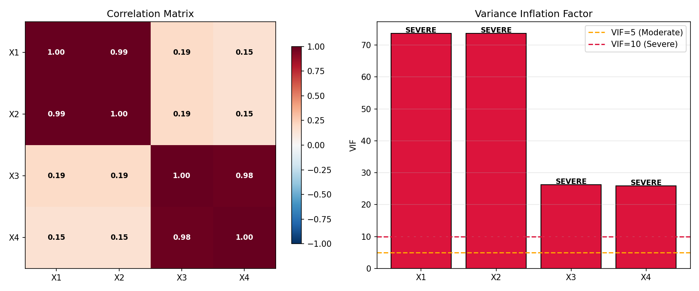
*Correlation matrix (left) shows strong pairwise correlations between X1-X2 and X3-X4. VIF bar chart (right) flags severe multicollinearity with VIF > 10 for all features.*

**Implementation (`07_vif_multicollinearity.py`):**

```python
for j in range(p):
    y_j = X[:, j]
    X_other = np.delete(X, j, axis=1)
    X_other = np.column_stack((np.ones(n), X_other))
    beta_j = np.linalg.solve(X_other.T @ X_other, X_other.T @ y_j)
    y_j_pred = X_other @ beta_j
    SS_res = np.sum((y_j - y_j_pred) ** 2)
    SS_tot = np.sum((y_j - np.mean(y_j)) ** 2)
    R2_j = 1 - SS_res / SS_tot
    vifs[j] = 1 / (1 - R2_j + 1e-10)
```

---

## 4. Implementation Explanation

### 4.1 Model Initialization

**Simple Linear Regression (`01_simple_linear.py`):** The model is initialized by constructing the design matrix with a column of ones followed by the predictor values:

```python
X = np.column_stack((np.ones(len(x)), x))
```

**Multiple Linear Regression (`02_multiple_linear.py`):** For multiple predictors, each additional column is stacked:

```python
X = np.column_stack((np.ones(len(x1)), x1, x2))
```

**Gradient Descent variants (`03_batch_gd.py`, `04_sgd.py`, `05_minibatch_gd.py`):** Parameters are initialized to zero:

```python
beta = np.zeros(p)
```

**Hyperparameters** (Gradient Descent only):

- `alpha` (learning rate): Controls step size in parameter updates.
- `iterations` / `epochs`: Number of passes over the data.
- `batch_size` (mini-batch only): Number of samples per gradient computation.

### 4.2 Training Function

#### Normal Equation (Closed-Form)

$$ \hat{\beta} = (X^T X)^{-1} X^T y \tag{3.6} $$

**Implementation (`01_simple_linear.py`, `02_multiple_linear.py`):**

```python
beta = np.linalg.solve(X.T @ X, X.T @ y)
```

`np.linalg.solve` is used instead of `np.linalg.inv(X.T @ X) @ X.T @ y` because it is numerically more stable and faster -- it solves the linear system $X^T X \beta = X^T y$ directly via LU decomposition rather than computing the matrix inverse.

**Mathematical derivation:** Setting the gradient of RSS to zero (ESL, p. 45):

$$\frac{\partial RSS}{\partial \beta} = -2 X^T (y - X\beta) = 0$$

$$X^T X \beta = X^T y$$

$$\hat{\beta} = (X^T X)^{-1} X^T y$$

**Reference:**

> Book: ESL  
> Chapter: 3 - Linear Methods for Regression  
> Section: 3.2 Linear Regression Models and Least Squares  
> Pages: 44-46  

#### Gradient Descent (Iterative)

$$\beta^{(t+1)} = \beta^{(t)} - \alpha \cdot \nabla RSS(\beta^{(t)})$$

The gradient of RSS is:

$$\nabla RSS(\beta) = \frac{2}{n} X^T (X\beta - y)$$

**Implementation (`03_batch_gd.py`):**

```python
for i in range(iterations):
    residuals = X @ beta - y
    gradient = (2 / n) * X.T @ residuals
    beta -= alpha * gradient
```

**Reference:**

> Book: ESL  
> Chapter: 3 - Linear Methods for Regression  
> Section: 3.2 Linear Regression Models and Least Squares  
> Pages: 44-46  

> Book: ISL  
> Chapter: 3 - Linear Regression  
> Section: 3.2.1 Estimating the Regression Coefficients  
> Pages: 81-82 [UNVERIFIED for Gradient Descent — ISL Ch. 3 covers the Normal Equation and least squares, not gradient descent; gradient descent appears in later chapters]  

**Implementation Note:** The Normal Equation is preferred for small to moderate $n$ and $p$ because it is deterministic and requires no hyperparameter tuning. Gradient Descent is preferred when $n$ or $p$ is very large because it avoids computing $O(np^2)$ matrix products.

### 4.3 Prediction Function

Once $\hat{\beta}$ is learned, predictions are made via:

$$\hat{y} = X \hat{\beta}$$

**Implementation:**

```python
y_pred = X @ beta
# or for a single new point:
prediction = new_x @ beta  # new_x = [1, x1_new, x2_new, ...]
```

This is the direct application of the linear model equation (3.19 from ISL).

### 4.4 Cost Function

The cost (mean squared error) is tracked during training to monitor convergence:

```python
cost = np.mean((y - X @ beta) ** 2)
cost_history.append(cost)
```

For Gradient Descent, monitoring the cost history helps detect convergence (cost flattens) or divergence (cost increases).

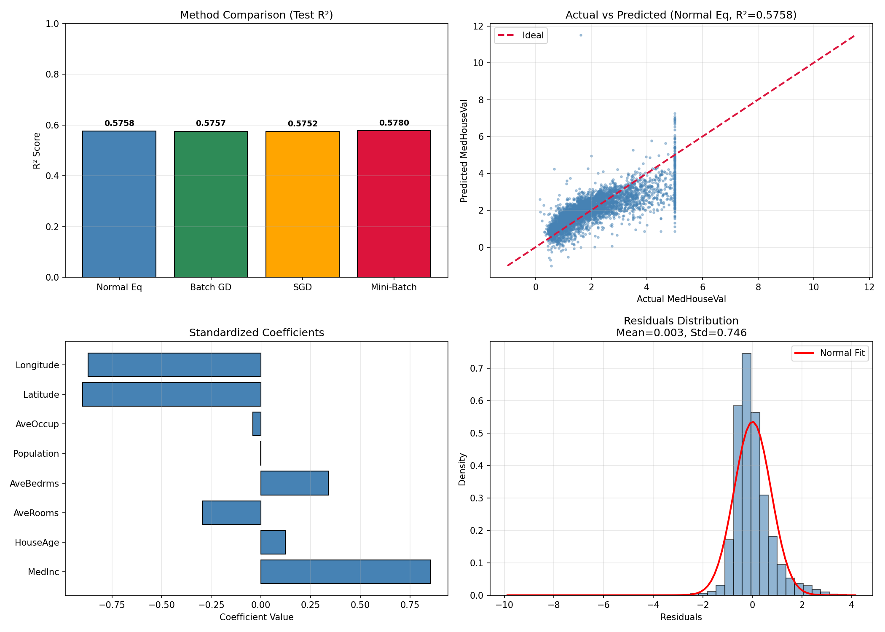
*Full pipeline applied to the California Housing dataset: (top-left) All four optimization methods achieve similar $R^2$ ~0.58. (top-right) Actual vs. predicted values from the Normal Equation. (bottom-left) Standardized coefficients show Latitude and Longitude are the strongest predictors of house prices. (bottom-right) Residual distribution is approximately normal with mean near zero.*

---

## 5. Optimization Methods

### 5.1 Normal Equation

$$ \hat{\beta} = (X^T X)^{-1} X^T y $$

**Mathematical intuition:** The Normal Equation projects $y$ onto the column space of $X$. The resulting $\hat{\beta}$ is the orthogonal projection of $y$ onto the subspace spanned by the predictors (ESL, p. 46). This is why the residuals $y - X\hat{\beta}$ are orthogonal to the column space of $X$.

**Geometric interpretation:** In $\mathbb{R}^n$ (the space of response vectors), the columns of $X$ span a $(p+1)$-dimensional subspace. The vector $y$ generally lies outside this subspace. The OLS solution $\hat{y} = X\hat{\beta}$ is the **orthogonal projection** of $y$ onto $Col(X)$ — the point in the column space closest to $y$. The residual vector $y - \hat{y}$ is perpendicular to every column of $X$, i.e., $X^T (y - X\hat{\beta}) = 0$, which is exactly the Normal Equation.

This geometric viewpoint explains why OLS is the best linear unbiased estimator (Gauss-Markov): any other linear estimator $\tilde{y} = Py$ in $Col(X)$ would have a larger distance $\|y - \tilde{y}\|$.

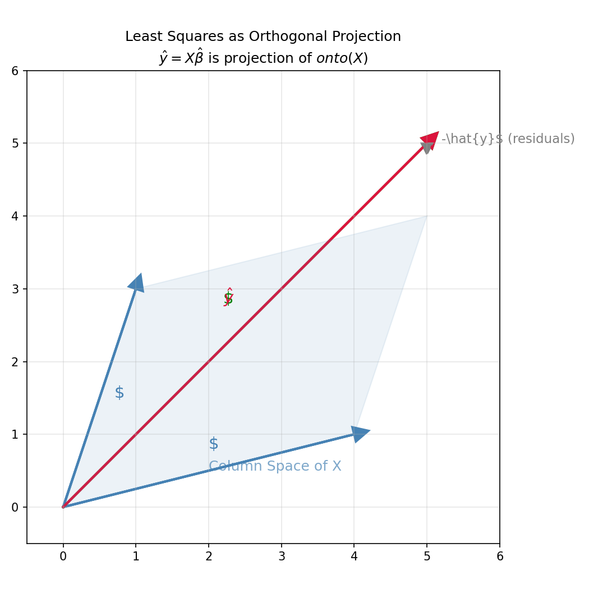
*Geometric view of least squares: $y$ (green) is projected orthogonally onto the column space of $X$ (blue parallelogram), yielding $\hat{y}$ (crimson). The residual vector $y - \hat{y}$ (gray dashed) is orthogonal to the column space, i.e., $X^T (y - X\hat{\beta}) = 0$.*

**Advantages:**

- Closed-form, deterministic solution (no hyperparameters)
- Finds the exact global minimum in one step
- No need to choose a learning rate

**Disadvantages:**

- $O(np^2 + p^3)$ computational complexity (computing $X^T X$ is $O(np^2)$, inverting it is $O(p^3)$)
- $O(p^2)$ memory to store $X^T X$
- Infeasible when $p$ is very large (e.g., $p > 10,000$)
- Cannot handle $p > n$ (singular $X^T X$)

**Reference:**

> Book: ISL  
> Chapter: 3 - Linear Regression  
> Section: 3.2.1 Estimating the Regression Coefficients  
> Pages: 81-82  

> Book: ESL  
> Chapter: 3 - Linear Methods for Regression  
> Section: 3.2 Linear Regression Models and Least Squares  
> Pages: 45-46  

### 5.2 Gradient Descent

Gradient Descent is an iterative first-order optimization algorithm. It updates parameters in the direction opposite to the gradient of the cost function.

#### Parameter Update Rule

$$\beta^{(t+1)} = \beta^{(t)} - \alpha \cdot \nabla J(\beta^{(t)})$$

where $\alpha$ is the **learning rate** and $J(\beta) = \frac{1}{n} \sum (y_i - X_i\beta)^2$ is the MSE.

The gradient for MSE is:

$$\nabla J(\beta) = -\frac{2}{n} X^T (y - X\beta) = \frac{2}{n} X^T (X\beta - y)$$

#### Batch Gradient Descent

Uses **all** training samples to compute the gradient at each step.

**Update rule:**

$$\beta := \beta - \alpha \cdot \frac{2}{n} X^T (X\beta - y)$$

**Implementation (`03_batch_gd.py`):**

```python
for i in range(iterations):
    residuals = X @ beta - y
    gradient = (2 / n) * X.T @ residuals
    beta -= alpha * gradient
```

| Aspect | Detail |
|--------|--------|
| Gradient | $\frac{2}{n} X^T (X\beta - y)$ |
| Per-iteration cost | $O(np)$ |
| Convergence | Smooth, but slow for large $n$ |
| Use case | Small to moderate $n$ |

#### Stochastic Gradient Descent (SGD)

Uses **one random sample** to estimate the gradient at each step.

**Update rule:**

$$\beta := \beta - \alpha_t \cdot 2 \cdot x_i (x_i^T \beta - y_i)$$

where $\alpha_t$ is a decaying learning rate.

Note that the per-sample gradient $2x_i(x_i^T\beta - y_i)$ drops the $1/n$ factor from the full-batch MSE gradient $(2/n)X^T(X\beta - y)$. This is not a rescaling — it is an **unbiased estimator**: $\mathbb{E}_{i \sim U(1,n)}[2x_i(x_i^T\beta - y_i)] = \frac{2}{n}X^T(X\beta - y)$, where the expectation is taken over uniform random sampling of indices.

**Implementation (`04_sgd.py`):**

```python
for epoch in range(epochs):
    indices = np.random.permutation(n)
    for i in range(n):
        xi = X_shuffled[i:i+1]
        yi = y_shuffled[i:i+1]
        pred = xi @ beta
        gradient = 2 * xi.T @ (pred - yi)
        lr = alpha / (1 + 0.01 * (epoch * n + i))
        beta -= lr * gradient.flatten()
```

| Aspect | Detail |
|--------|--------|
| Gradient | $2 \cdot x_i (x_i^T \beta - y_i)$ |
| Per-iteration cost | $O(p)$ |
| Convergence | Noisy, can escape local minima |
| Use case | Very large $n$; online learning |

#### Mini-Batch Gradient Descent

Uses a **batch of $b$ samples** to compute the gradient.

**Update rule:**

$$\beta := \beta - \alpha \cdot \frac{2}{b} X_b^T (X_b\beta - y_b)$$

**Implementation (`05_minibatch_gd.py`):**

```python
for epoch in range(epochs):
    indices = np.random.permutation(n)
    for start in range(0, n, batch_size):
        end = start + batch_size
        X_batch = X_shuffled[start:end]
        y_batch = y_shuffled[start:end]
        b = X_batch.shape[0]
        residuals = X_batch @ beta - y_batch
        gradient = (2 / b) * X_batch.T @ residuals
        beta -= alpha * gradient
```

| Aspect | Detail |
|--------|--------|
| Gradient | $\frac{2}{b} X_b^T (X_b\beta - y_b)$ |
| Per-iteration cost | $O(bp)$ |
| Convergence | Smoother than SGD, faster than Batch |
| Use case | Large $n$; standard deep learning practice |

#### Comparison

| Method | Samples per Step | Noise | Convergence Speed | Memory |
|--------|-----------------|-------|-------------------|--------|
| Batch GD | All $n$ | None | Slow per step, fast per epoch | High |
| SGD | 1 | High | Fast per step, slow per epoch | Low |
| Mini-Batch | $b$ (e.g., 16-256) | Moderate | Best trade-off | Moderate |

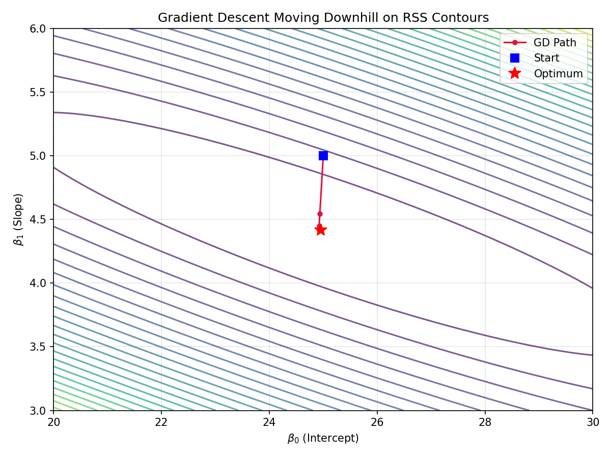
*Gradient Descent visualized on the RSS contour map. The blue square marks the starting point ($\beta_0=25, \beta_1=5$), the red star marks the optimum, and the crimson path shows each step moving downhill (orthogonal to the contours) toward the minimum.*

### 5.3 Numerical Considerations

#### 5.3.1 Singular $X^T X$ ($p > n$)

When $p > n$ (more predictors than observations), the design matrix $X$ has rank at most $n$, so $X^T X$ is singular and the Normal Equation has no unique solution. An infinite set of $\beta$ vectors achieves zero training error.

**Solutions:**

- **Ridge regression** (ESL Section 3.4.1, p. 63): Adds $\lambda \|\beta\|_2^2$ to the loss, making $X^T X + \lambda I$ invertible.
- **Moore-Penrose pseudo-inverse** ($X^+$): $\hat{\beta} = X^+ y$ gives the minimum-norm solution.
- **LASSO / Elastic Net** (ESL Chapter 3.4.2-3.4.3): Induces sparsity.

#### 5.3.2 Ill-Conditioned $X^T X$ (Near-Multicollinearity)

Even when $p < n$, strong correlations among predictors make $X^T X$ nearly singular. The **condition number** $\kappa(X^T X) = \lambda_{\max} / \lambda_{\min}$ quantifies this.

| $\kappa$ | Severity |
|----------|----------|
| $< 100$ | No problem |
| $100 - 1000$ | Moderate ill-conditioning |
| $> 1000$ | Severe; coefficients become highly sensitive to small changes in $y$ |

An ill-conditioned system means small rounding errors or measurement noise in $y$ can produce large changes in $\hat{\beta}$.

#### 5.3.3 Alternatives to the Normal Equation

| Method | Complexity | Pros | Cons |
|--------|-----------|------|------|
| **QR Decomposition** | $O(np^2)$ | More stable than Normal Eq; handles rank-deficient $X$ | Still $O(p^3)$ for triangular solve |
| **SVD** (Singular Value Decomposition) | $O(np^2 + p^3)$ | Most stable; works for singular $X$; gives pseudo-inverse | Slowest of the three |
| **Cholesky Decomposition** | $O(p^3/3)$ | Fastest for SPD $X^T X$ | Requires $X^T X$ to be positive definite |

**QR approach** ($X = QR$):
$$\hat{\beta} = R^{-1} Q^T y$$
QR avoids forming $X^T X$ explicitly, reducing numerical error (ESL, p. 45).

**SVD approach** ($X = UDV^T$):
$$\hat{\beta} = V D^+ U^T y$$
where $D^+$ inverts only non-zero singular values. This gives the minimum-norm least squares solution and works for all cases, including $p > n$.

Our implementation uses `np.linalg.solve`, which internally calls LU decomposition (similar in spirit to QR for well-conditioned problems).

**Reference:**

> Book: ESL  
> Chapter: 3 - Linear Methods for Regression  
> Section: 3.2 Linear Regression Models and Least Squares  
> Pages: 44-46  

> Book: ISL  
> Chapter: 3 - Linear Regression  
> Section: 3.2.1 Estimating the Regression Coefficients  
> Pages: 81-82 [UNVERIFIED for numerical considerations — ISL Ch. 3 does not discuss condition number, SVD, or QR for linear regression]

#### Convergence Visualizations

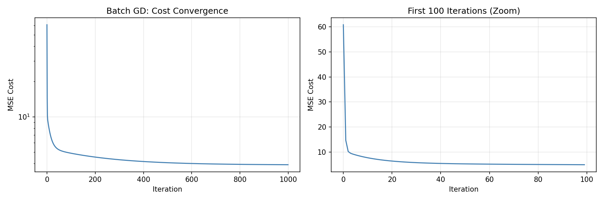
*Batch GD cost decreases smoothly and monotonically. The log-scale plot (left) shows steady improvement; the zoomed view (right) reveals the rapid initial drop typical of gradient methods.*

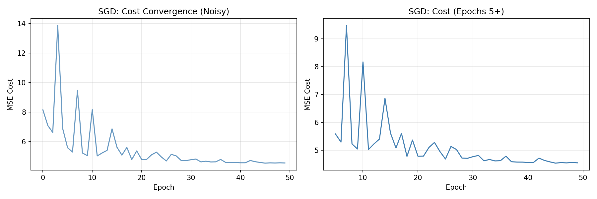
*SGD cost trajectory is noisy due to single-sample gradient estimates. The zoomed view (right) shows that even after convergence, cost values fluctuate around the minimum.*

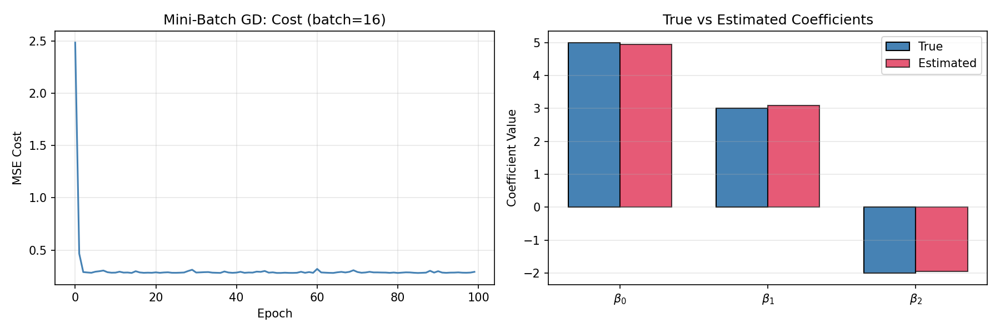
*Mini-Batch GD cost converges smoothly (left). The bar chart (right) compares estimated coefficients against the true values ($\beta_0=5, \beta_1=3, \beta_2=-2$), demonstrating accurate recovery.*

---

## 6. Algorithm Workflow

```
                      +------------------+
                      |    Load Data      |
                      |  (X, y)           |
                      +--------+---------+
                               |
                               v
                      +------------------+
                      |  Add Intercept    |
                      |  Column of 1s     |
                      +--------+---------+
                               |
                    +----------+----------+
                    |                     |
                    v                     v
          +------------------+  +------------------+
          | Normal Equation  |  | Gradient Descent |
          | beta = solve(    |  | Initialize       |
          |   X^T X, X^T y)  |  | beta = zeros(p)  |
          +--------+---------+  +--------+---------+
                   |                     |
                   |                     v
                   |            +------------------+
                   |            | Compute          |
                   |            | Predictions       |
                   |            | y_pred = X @ beta |
                   |            +--------+---------+
                   |                     |
                   |                     v
                   |            +------------------+
                   |            | Compute           |
                   |            | Gradient          |
                   |            | grad = 2/n X^T    |
                   |            | (X beta - y)      |
                   |            +--------+---------+
                   |                     |
                   |                     v
                   |            +------------------+
                   |            | Update Parameters |
                   |            | beta -= alpha *   |
                   |            |        grad       |
                   |            +--------+---------+
                   |                     |
                   |            +--------+---------+
                   |            | Convergence?     |
                   |            | (cost change <   |
                   |            |  tol or max iter)|
                   |            +--+-----------+-+
                   |               |           |
                   |               | No        | Yes
                   |               v           |
                   |            (repeat)       |
                   |                           |
                   +----------->---------------+
                               |
                               v
                      +------------------+
                      |  Make Predictions |
                      |  y_test_pred =    |
                      |  X_test @ beta    |
                      +--------+---------+
                               |
                               v
                      +------------------+
                      |  Evaluate         |
                      |  MAE, MSE, RMSE,  |
                      |  R^2              |
                      +------------------+
```

---

## 7. Evaluation Metrics

### 7.1 Mean Absolute Error (MAE)

$$MAE = \frac{1}{n} \sum_{i=1}^{n} |y_i - \hat{y}_i|$$

- **Interpretation:** Average absolute deviation of predictions from true values.
- **Units:** Same as the response variable.
- **When to use:** When you want a metric that is robust to outliers (less sensitive than MSE).
- **Good values:** Close to 0. Bad values: Large relative to the scale of $Y$.

**Implementation:**

```python
MAE = np.mean(np.abs(y - y_pred))
```

### 7.2 Mean Squared Error (MSE)

$$MSE = \frac{1}{n} \sum_{i=1}^{n} (y_i - \hat{y}_i)^2$$

- **Interpretation:** Average squared deviation. Penalizes large errors more heavily than MAE.
- **Units:** Squared units of the response.
- **When to use:** Default metric for regression; differentiable, making it suitable for optimization.
- **Good values:** Close to 0.

**Implementation:**

```python
MSE = np.mean((y - y_pred) ** 2)
```

### 7.3 Root Mean Squared Error (RMSE)

$$RMSE = \sqrt{MSE} = \sqrt{\frac{1}{n} \sum_{i=1}^{n} (y_i - \hat{y}_i)^2}$$

- **Interpretation:** Standard deviation of the residuals. Same units as $Y$.
- **When to use:** When you want MSE's properties but interpretable in the original units.
- **Good values:** Close to 0. A benchmark is comparing RMSE to the standard deviation of $Y$ -- if RMSE < $\sigma_Y$, the model is useful.

**Implementation:**

```python
RMSE = np.sqrt(MSE)
```

### 7.4 R-Squared ($R^2$)

$$R^2 = 1 - \frac{\sum_{i=1}^{n} (y_i - \hat{y}_i)^2}{\sum_{i=1}^{n} (y_i - \bar{y})^2} = 1 - \frac{RSS}{TSS}$$

where $TSS = \sum (y_i - \bar{y})^2$ is the total sum of squares.

- **Interpretation:** Proportion of variance in $Y$ explained by the model.
- **Range:** $(-\infty, 1]$. Usually $[0, 1]$ for training data. Can be negative for test data (model worse than predicting the mean).
- **When to use:** To assess overall model fit relative to a baseline.
- **Good values:** Close to 1. Bad values: Close to 0 or negative.
- **Limitation:** $R^2$ always increases with more predictors on training data, even if they are noise. Use adjusted $R^2$ for model selection.

**Implementation:**

```python
R2 = 1 - np.sum((y - y_pred) ** 2) / np.sum((y - np.mean(y)) ** 2)
```

**Reference:**

> Book: ISL  
> Chapter: 3 - Linear Regression  
> Section: 3.1.3 Assessing the Accuracy of the Model  
> Pages: 77-80  

> Book: ESL  
> Chapter: 3 - Linear Methods for Regression  
> Section: 3.2 Linear Regression Models and Least Squares  
> Pages: 47-48 (RSE and related)  

### 7.4a Worked Example — Metrics from the House Price Table

Using the three-observation house price scenario from Section 2.2:

| $i$ | $y_i$ | $\hat{y}_i$ | $y_i - \hat{y}_i$ | $(y_i - \hat{y}_i)^2$ |
|-----|-------|-------------|-------------------|----------------------|
| 1   | 255,000 | 245,000 | +10,000 | $1.00 \times 10^8$ |
| 2   | 340,000 | 340,000 | 0 | 0 |
| 3   | 460,000 | 435,000 | +25,000 | $6.25 \times 10^8$ |

$\bar{y} = 351,666.67$,  $TSS = \sum (y_i - \bar{y})^2 = 2.12 \times 10^{10}$,  $RSS = \sum (y_i - \hat{y}_i)^2 = 7.25 \times 10^{8}$.

$$MAE = \frac{|10{,}000| + |0| + |25{,}000|}{3} = 11{,}666.67$$
$$MSE = \frac{1.00 \times 10^8 + 0 + 6.25 \times 10^8}{3} = 241{,}666{,}666.67$$
$$RMSE = \sqrt{MSE} \approx 15{,}545.63$$
$$R^2 = 1 - \frac{RSS}{TSS} = 1 - \frac{7.25 \times 10^8}{2.12 \times 10^{10}} \approx 0.9658$$

The model explains 96.6% of the variance in house prices, with an average absolute error of about \$11,667. The RMSE (\$15,546) is substantially smaller than the standard deviation of $Y$ ($\sigma_Y \approx 108{,}277$), confirming useful predictive power.

### 7.5 Coefficient Interpretation

#### Simple Linear Regression

In $Y = \beta_0 + \beta_1 X$, a **one-unit increase** in $X$ is associated with a **$\beta_1$-unit change** in $Y$ on average.

**Example (House Price model):** If $\hat{\beta}_1 = 150$ for `Size (sq ft)`:

- A house that is 1 sq ft larger is predicted to cost \$150 more, on average.
- A house that is 500 sq ft larger $\rightarrow 500 \times 150 = \$75{,}000$ more.

#### Multiple Linear Regression

In $Y = \beta_0 + \beta_1 X_1 + \beta_2 X_2$, each coefficient is a **partial effect** (ceteris paribus -- "all else held fixed").

| Predictor | $\hat{\beta}_j$ | Interpretation |
|-----------|----------------|---------------|
| Size (sq ft) | 130 | Holding bedrooms fixed, an extra sq ft $\rightarrow$ +\$130 |
| Bedrooms | 8,500 | Holding size fixed, an extra bedroom $\rightarrow$ +\$8,500 |
| Age (years) | -2,100 | Holding size & bedrooms fixed, one more year $\rightarrow$ -\$2,100 |

**Warning:** Coefficients are not directly comparable when predictors are on different scales. Standardizing features (subtract mean, divide by std) converts coefficients to **standardized betas**:

$$\beta_j^{\text{std}} = \beta_j \cdot \frac{\text{SD}(X_j)}{\text{SD}(Y)}$$

These are unitless and can be compared: the predictor with the largest $|\beta_j^{\text{std}}|$ has the strongest "effect" on $Y$.

#### Categorical Predictors

For a binary predictor (e.g., `HasPool = 1` or `0`):

- $\hat{\beta} = 12{,}000$ means: a house with a pool is predicted to cost \$12,000 more than an otherwise identical house without one.

**Reference:**

> Book: ISL  
> Chapter: 3 - Linear Regression  
> Section: 3.1.2 Interpreting the Coefficients (Simple), 3.2.2 Interpreting the Coefficients (Multiple)  
> Pages: 73, 83-84  

> Book: ESL  
> Chapter: 3 - Linear Methods for Regression  
> Section: 3.2 Linear Regression Models and Least Squares  
> Pages: 44-45  

### 7.6 Confidence and Prediction Intervals

The **confidence interval** for the mean response at a new point $x_0$ is:

$$\hat{y}_0 \pm t_{\alpha/2, n-p-1} \cdot \hat{\sigma} \sqrt{x_0^T (X^T X)^{-1} x_0}$$

The **prediction interval** for an individual observation is wider:

$$\hat{y}_0 \pm t_{\alpha/2, n-p-1} \cdot \hat{\sigma} \sqrt{1 + x_0^T (X^T X)^{-1} x_0}$$

The prediction interval accounts for both the uncertainty in $\hat{y}_0$ and the irreducible error $\varepsilon_0$.

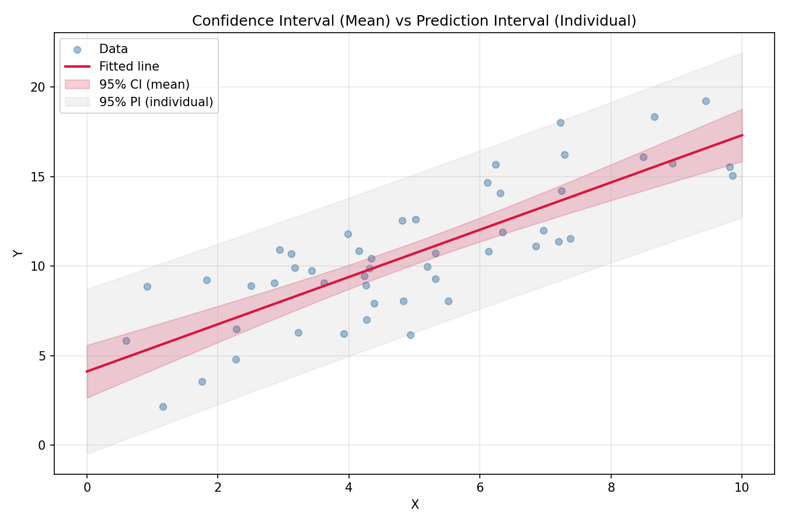
*The 95% confidence interval for the mean (dark red band) is narrower than the 95% prediction interval for individual observations (light gray band). The PI always includes the CI plus the estimated error variance $\hat{\sigma}^2$.*

**Reference:**

> Book: ISL  
> Chapter: 3 - Linear Regression  
> Section: 3.2.2 Some Important Questions (prediction intervals); 3.1.2 (coefficient CIs)  
> Pages: 76-77, 90-91 [UNVERIFIED for Section 3.2.4 — ISLP Python edition has no Section 3.2.4; CI/PI discussion is distributed across Sections 3.1.2 (coefficient CIs) and 3.2.2 (prediction vs. inference)]

> Book: ESL  
> Chapter: 3 - Linear Methods for Regression  
> Section: 3.2.2 The Gauss-Markov Theorem  
> Pages: 50-52 [UNVERIFIED for CI/PI formulas — ESL pp.50-52 discuss Gauss-Markov theory, not the CI/PI formulas shown here]

---

## 8. Model Diagnostics

### 8.1 Residual Analysis

**Purpose:** Residuals reveal violations of model assumptions (non-linearity, heteroscedasticity, outliers).

**Residual plot:** Plot $e_i = y_i - \hat{y}_i$ versus fitted values $\hat{y}_i$.

- **Random scatter around zero** $\implies$ assumptions hold.
- **U-shaped pattern** $\implies$ non-linearity.
- **Funnel shape** $\implies$ heteroscedasticity.
- **Points far from zero** $\implies$ potential outliers.

**Studentized residuals:**

$$r_i = \frac{e_i}{\hat{\sigma} \sqrt{1 - h_{ii}}}$$

where $h_{ii}$ is the leverage of observation $i$. Observations with $|r_i| > 3$ are potential outliers.

**Implementation (`06_diagnostics.py`):**

```python
H = X @ np.linalg.inv(X.T @ X) @ X.T
h = np.diag(H)
RSS = np.sum(residuals ** 2)
RSE = np.sqrt(RSS / (n - p))
studentized = residuals / (RSE * np.sqrt(1 - h))
```

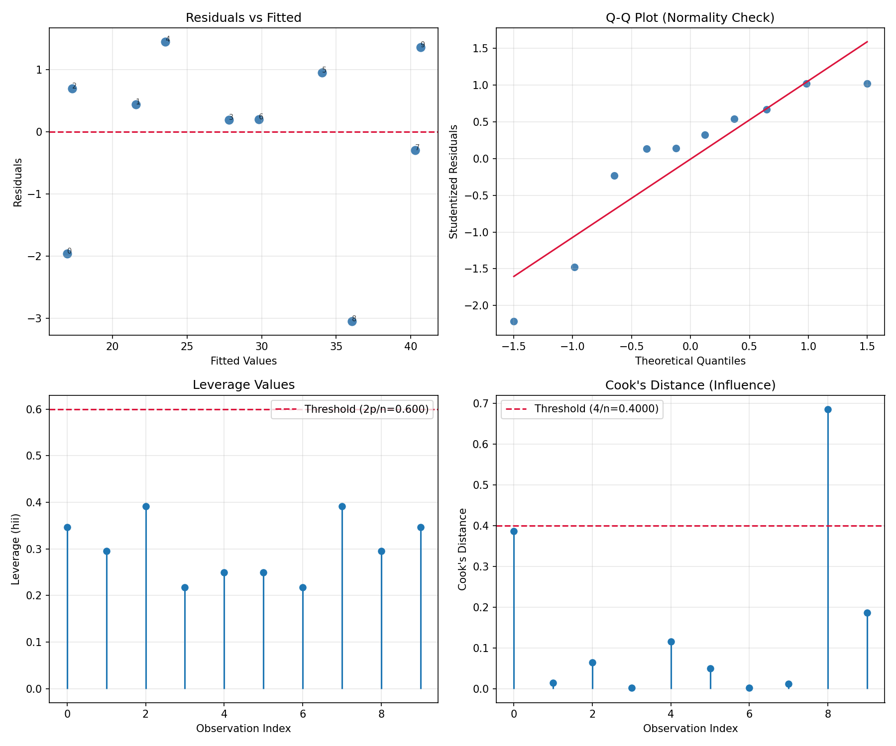
*Four diagnostic plots from `06_diagnostics.py`: (top-left) Residuals vs. fitted shows random scatter. (top-right) Q-Q plot checks normality. (bottom-left) Leverage values with threshold. (bottom-right) Cook's distance identifies influential point 8 as exceeding the $4/n$ threshold.*

**Reference:**

> Book: ISL  
> Chapter: 3 - Linear Regression  
> Section: 3.3.3 Potential Problems  
> Pages: 100-106  

### 8.2 Leverage and Cook's Distance

**Leverage ($h_{ii}$):** Measures how far an observation's predictor values are from the mean. The diagonal of the hat matrix $H = X(X^T X)^{-1} X^T$.

- Average leverage: $(p+1)/n$
- High leverage: $h_{ii} > 2(p+1)/n$

**Cook's Distance ($D_i$):** Measures the influence of each observation on the fitted coefficients.

$$D_i = \frac{r_i^2}{p} \cdot \frac{h_{ii}}{1 - h_{ii}}$$

- $D_i > 4/n$ suggests an influential point.

**Implementation (`06_diagnostics.py`):**

```python
cooks_d = (studentized ** 2 / p) * (h / (1 - h))
```

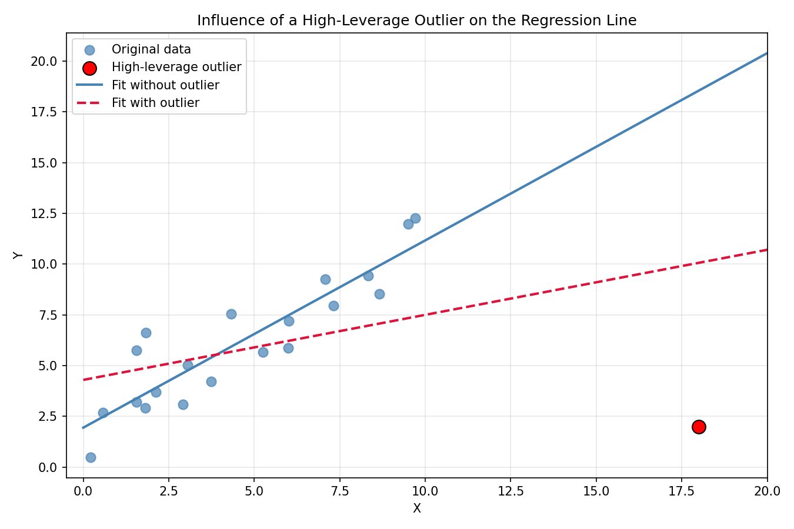
*A single high-leverage outlier ($x=18, y=2$) dramatically changes the fitted regression line (crimson dashed) compared to the fit without it (solid blue). This illustrates why leverage and Cook's distance are essential diagnostic tools -- one unusual point can dominate the OLS solution.*

> **Footnote:** The Cook's distance formula uses $p$ (the number of model parameters including the intercept) in the denominator, matching the implementation in `06_diagnostics.py`. Some references define $p$ as the number of predictors only (excluding the intercept) and write $p+1$ in the denominator — both conventions are equivalent; this document follows the former.

**Reference:**

> Book: ISL  
> Chapter: 3 - Linear Regression  
> Section: 3.3.3 Potential Problems (4. Outliers, 5. High Leverage Points)  
> Pages: 104-106 [UNVERIFIED for explicit Cook's distance formula — ISL discusses studentized residuals and leverage conceptually but does not state the Cook's distance formula]  

### 8.3 Prediction vs. Actual Plot

Plot $\hat{y}_i$ versus $y_i$. For a perfect model, all points lie on the 45-degree line. Deviations from the line indicate prediction errors. The spread around the line reflects the model's accuracy.

**Implementation Note:** This plot is generated in the diagnostic workflow of `10_housing_demo.py` when comparing Normal Equation, Batch GD, SGD, and Mini-Batch GD predictions.

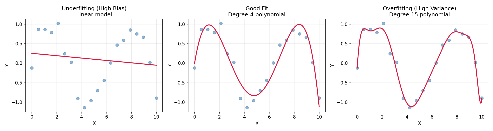
*Three models fitted to the same sinusoidal data: (left) linear model underfits, missing the curvature (high bias); (center) degree-4 polynomial captures the pattern well; (right) degree-15 polynomial overfits (high variance), interpolating the training points but generalizing poorly.*

### 8.4 Learning Curves

Learning curves plot training and validation scores ($R^2$ or error) as a function of training set size.

**Interpretation:**

- **Small gap + high scores** = good fit (low bias, low variance).
- **Large gap** = overfitting (low bias, high variance).
- **Both low** = underfitting (high bias).
- **Curves converge** = model is stable; more data may not help.
- **Curves don't converge** = need more data or a simpler model.

**Implementation (`09_learning_curves.py`):**

```python
for train_size in train_sizes:
    for fold in range(n_folds):
        indices = np.random.permutation(n)
        train_idx = indices[:train_size]
        val_idx = indices[train_size:min(train_size + n // 4, n)]
        beta_fold = np.linalg.solve(X_train.T @ X_train, X_train.T @ y_train)
        # Track R^2 for both train and validation
```

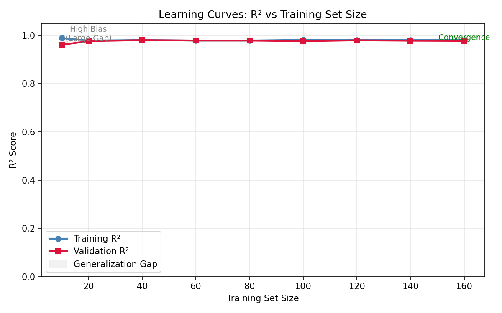
*Learning curves from `09_learning_curves.py` show both training and validation $R^2$ converging to the same high value (~0.98) as the training set size increases. The small generalization gap (shaded region) and rapid convergence indicate a well-specified model with low bias and low variance.*

**Reference:**

> Book: ISL  
> Chapter: 2 - Statistical Learning  
> Section: 2.2.2 The Bias-Variance Trade-Off  
> Pages: 31-34  

---

## 9. ISL vs. ESL Comparison

| Topic | ISL Explanation | ESL Explanation | Implementation |
|-------|----------------|-----------------|----------------|
| **Linear Regression Theory** | Introductory, intuition-focused. Introduces simple linear regression first, then multiple. Uses `sales ~ TV` example. (ISL p. 69-82) | Mathematical, rigorous. Introduces matrix notation immediately. Uses prostate cancer data. (ESL p. 43-50) | Uses both simple and multiple examples to match ISL's pedagogical approach |
| **Least Squares** | Minimizes RSS; gives formulas for $\hat{\beta}_0$, $\hat{\beta}_1$ explicitly. (ISL p. 71, Eqs. 3.3-3.4) | Derives via matrix calculus: $\hat{\beta} = (X^T X)^{-1} X^T y$. (ESL p. 45, Eq. 3.6) | Implements the matrix form (ESL approach) |
| **Normal Equation** | Implicit via `np.linalg.solve` in lab (ISL p. 117) [UNVERIFIED — ISLP lab uses `sm.OLS()` from statsmodels, not `np.linalg.solve`] | Explicit derivation: setting gradient to zero (ESL p. 45, Eqs. 3.4-3.6) | Uses `np.linalg.solve(X.T @ X, X.T @ y)` |
| **Gradient Descent** | Not covered in Chapter 3. Mentioned only in later chapters. | Not covered in Chapter 3 (focus on Least Squares and Shrinkage). | Implements Batch, SGD, and Mini-Batch from scratch |
| **Model Assumptions** | Dedicated section (3.3.3) with 6 potential problems. Practical guidance. (ISL p. 100-109) | Mentions assumptions (Gaussian, constant variance) but focuses on sampling properties. (ESL p. 47-48) | `08_assumptions.py` tests all four key assumptions |
| **Mathematical Depth** | Minimal calculus; emphasizes intuition and interpretation. | Full matrix derivation, Gauss-Markov theorem, bias-variance decomposition for linear models. (ESL p. 45-52) | Bridges both: code comments show formulas, doc explains theory |
| **Multicollinearity** | Introduces VIF with Credit data example. (ISL p. 106-108) | Discusses correlation matrices; mentions rank deficiency. (ESL p. 46-47, 49-50) | `07_vif_multicollinearity.py` computes VIF |
| **Evaluation Metrics** | RSE, $R^2$, $F$-statistic. (ISL p. 77-80, 84-86) | RSS, $\hat{\sigma}^2$, $R^2$, $F$-statistic, $z$-scores. (ESL p. 47-49) | MAE, MSE, RMSE, $R^2$ (all files) |
| **Practical Implementation** | Python lab (Section 3.6) using `statsmodels`. (ISL p. 116-127) | R-based examples; focuses on concepts over code. | Pure NumPy implementation from scratch |

---

## 10. Real Datasets in Linear Regression

Linear regression has been applied extensively to real-world datasets. Three classic examples from the literature illustrate different aspects of the method.

### Boston Housing

The Boston Housing dataset (1978, Harrison & Rubinfeld) studies median house prices in 506 Boston suburbs. Predictors include per-capita crime rate, average number of rooms, property tax rate, and distance to employment centers. A simple linear model typically achieves $R^2 \approx 0.74$, with `RM` (average rooms) and `LSTAT` (% lower status population) being the strongest predictors. This dataset appears in ESL Section 3.2.1 (p. 49) for model comparison.

### Diabetes Progression

The diabetes dataset (Efron et al., 2004) tracks 442 patients with 10 baseline predictors (age, sex, BMI, blood pressure, and six blood serum measurements). The response is a quantitative measure of disease progression one year after baseline. A linear regression typically achieves $R^2 \approx 0.52$. This dataset is used throughout ESL Chapter 3 (p. 49, p. 59) to compare least squares with ridge regression, LASSO, and principal components regression.

### Advertising (ISL)

The Advertising dataset (ISL Chapter 3) records sales (in thousands of units) against TV, radio, and newspaper advertising budgets (in thousands of dollars) for 200 markets. Simple linear regressions show:

- **TV** is the strongest individual predictor (slope $\approx 0.0475$, $R^2 \approx 0.61$).
- **Radio** has moderate predictive power (slope $\approx 0.203$, $R^2 \approx 0.33$).
- **Newspaper** has a near-zero partial effect when TV and radio are already in the model (multiple regression reveals it was a confounded predictor).

This highlights why multiple regression is essential: pairwise correlations can be misleading.

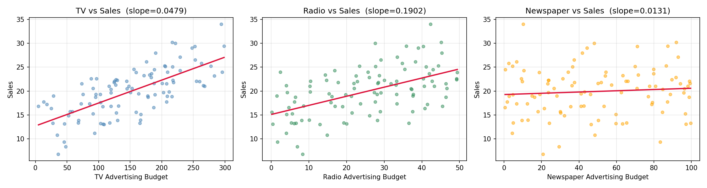
*Simulated examples of the ISL Advertising data style. TV (left) has the steepest slope and tightest fit; Radio (center) shows moderate association; Newspaper (right) has a near-flat relationship with Sales, consistent with the finding that newspaper adds little once TV and radio are accounted for.*

**Reference:**

> Book: ISL  
> Chapter: 3 - Linear Regression  
> Section: 3.1 Simple Linear Regression (TV vs Sales)  
> Pages: 72-76  

> Book: ESL  
> Chapter: 3 - Linear Methods for Regression  
> Section: 3.2.1 Example: Prostate Cancer / Diabetes  
> Pages: 49-50  

---

## 11. Common Mistakes

### Checklist of Pitfalls

| # | Mistake | Explanation | How to Avoid |
|---|---------|-------------|--------------|
| 1 | **Using wrong features** | Including irrelevant or noisy predictors degrades model performance. | Use domain knowledge, feature selection, or regularization. |
| 2 | **Data leakage** | Using information from the test set during training (e.g., scaling before splitting). | Always split before any preprocessing. Fit scalers on training data only. |
| 3 | **Ignoring assumptions** | Failing to check linearity, independence, homoscedasticity, and normality. | Run assumption checks (`08_assumptions.py`) after every fit. |
| 4 | **Incorrect preprocessing** | Not handling missing values, outliers, or scaling appropriately. | Standardize for GD; handle missing data before fitting. |
| 5 | **Incorrect evaluation** | Reporting training error instead of test error; using $R^2$ alone. | Always evaluate on held-out test data; use multiple metrics. |
| 6 | **Misinterpreting coefficients** | Confusing correlation with causation; ignoring the *ceteris paribus* interpretation. | Remember: $\beta_j$ measures the change in $Y$ per unit change in $X_j$ holding all else fixed. |
| 7 | **Overfitting** | Including too many predictors or high-degree polynomial terms. | Use learning curves (`09_learning_curves.py`); prefer simpler models. |
| 8 | **Ignoring multicollinearity** | Including highly correlated predictors without checking VIF. | Compute VIF (`07_vif_multicollinearity.py`); drop or combine collinear variables. |
| 9 | **Extrapolating** | Predicting beyond the range of training data. | Linear models extrapolate linearly; this may be unreasonable. |
| 10 | **Using Normal Equation when $p > n$** | $X^T X$ is singular and cannot be inverted. | Use gradient descent, ridge regression, or dimensionality reduction. |

---

## 12. Implementation Notes

**Implementation Note — Normal Equation vs. Gradient Descent:**

The Normal Equation provides an exact, closed-form solution and should be the default for problems where $n < 10,000$ and $p < 1,000$. When $n$ or $p$ is large, gradient descent variants are more computationally efficient. In `10_housing_demo.py`, all four methods (Normal Equation, Batch GD, SGD, Mini-Batch GD) are compared on the California Housing dataset to demonstrate that they converge to the same solution.

**Implementation Note — Feature Scaling:**

Gradient Descent requires features to be on a similar scale. In `10_housing_demo.py`, features are standardized to have mean 0 and variance 1 before applying GD:

```python
X_mean = np.mean(X_train, axis=0)
X_std = np.std(X_train, axis=0)
X_train_s = (X_train - X_mean) / X_std
```

The Normal Equation does not require scaling because matrix inversion handles different scales automatically.

**Implementation Note — `np.linalg.solve` vs. `np.linalg.inv`:**

Using `np.linalg.solve(A, b)` is numerically more stable and faster than `np.linalg.inv(A) @ b`. The `solve` function uses LU decomposition ($O(p^3)$) rather than explicitly computing the inverse, which avoids amplifying rounding errors.

**Implementation Note — Learning Rate Decay (SGD):**

In `04_sgd.py`, the learning rate decays over time:

```python
lr = alpha / (1 + 0.01 * (epoch * n + i))
```

This is essential for SGD convergence. A constant learning rate would cause the parameters to oscillate around the minimum without converging. The decay schedule $\alpha_t = \alpha_0 / (1 + \lambda t)$ is a simple and effective choice.

**Implementation Note — Pseudo-Inverse for $p > n$:**

When $p > n$, $X^T X$ is singular. The implementation does not handle this case automatically. In practice, use ridge regression (ESL, Section 3.4.1) or the Moore-Penrose pseudo-inverse (`np.linalg.pinv`).

**Implementation Note — Adding an Intercept:**

The intercept column of ones must be added manually. A common mistake is to standardize the intercept column as well, which should be avoided. In `10_housing_demo.py`, features are standardized *before* adding the intercept column:

```python
X_train_s = (X_train - X_mean) / X_std         # Standardize
X_train_d = np.column_stack((np.ones(n_train), X_train_s))  # Then add intercept
```

**Implementation Note — Train/Test Split (Preventing Data Leakage):**

Common Mistake #2 warns against data leakage. The correct workflow: split indices first, fit the scaler on the training set only, then transform both training and test sets using the training-derived statistics, and finally fit and evaluate separately:

```python
n_train = int(0.8 * n)
indices = np.random.permutation(n)
train_idx, test_idx = indices[:n_train], indices[n_train:]

X_train, X_test = X[train_idx], X[test_idx]
y_train, y_test = y[train_idx], y[test_idx]

# fit scaler on train only, transform both
X_mean = np.mean(X_train, axis=0)
X_std  = np.std(X_train, axis=0)
X_train_s = (X_train - X_mean) / X_std
X_test_s  = (X_test  - X_mean) / X_std

# add intercept after scaling
X_train_d = np.column_stack((np.ones(n_train), X_train_s))
X_test_d  = np.column_stack((np.ones(n - n_train), X_test_s))

# fit beta on train, evaluate on test
beta = np.linalg.solve(X_train_d.T @ X_train_d, X_train_d.T @ y_train)
y_test_pred = X_test_d @ beta
test_mse = np.mean((y_test - y_test_pred) ** 2)
```

**Implementation Note — Numerical Stability in VIF:**

In `07_vif_multicollinearity.py`, a small epsilon ($10^{-10}$) is added to the denominator:

```python
vifs[j] = 1 / (1 - R2_j + 1e-10)
```

This prevents division by zero when a predictor is perfectly explained by the others ($R^2_j = 1$).

**Implementation Note — Coefficient Interpretation with Standardized Features:**

When features are standardized, the coefficients represent the change in $Y$ for a **one standard deviation** increase in $X_j$, rather than a one-unit increase. This is noted in `10_housing_demo.py`:

```python
print("  Each Betaj = change in MedHouseVal for 1 sigma increase in Xj")
```

---

## 13. Final Cheat Sheet

### Main Formulas

| Concept | Formula |
|---------|---------|
| Linear Model | $Y = \beta_0 + \beta_1 X_1 + \dots + \beta_p X_p + \varepsilon$ |
| Matrix Form | $y = X\beta + \varepsilon$ |
| Normal Equation | $\hat{\beta} = (X^T X)^{-1} X^T y$ |
| Predictions | $\hat{y} = X \hat{\beta}$ |
| Residuals | $e_i = y_i - \hat{y}_i$ |
| RSS | $\sum (y_i - \hat{y}_i)^2$ |
| MSE | $\frac{1}{n} \sum (y_i - \hat{y}_i)^2$ |
| RMSE | $\sqrt{MSE}$ |
| MAE | $\frac{1}{n} \sum |y_i - \hat{y}_i|$ |
| $R^2$ | $1 - \frac{RSS}{TSS}$ |
| RSE | $\sqrt{\frac{RSS}{n - p - 1}}$ |
| $F$-statistic | $\frac{(TSS - RSS)/p}{RSS/(n - p - 1)}$ |
| Gradient (Batch) | $\nabla J = \frac{2}{n} X^T (X\beta - y)$ |
| Gradient (SGD) | $\nabla J_i = 2 x_i (x_i^T \beta - y_i)$ |
| Parameter Update | $\beta := \beta - \alpha \nabla J$ |
| VIF | $VIF_j = 1 / (1 - R^2_j)$ |
| Cook's Distance | $D_i = \frac{r_i^2}{p} \cdot \frac{h_{ii}}{1 - h_{ii}}$ |

### Important Rules

| Rule | Description |
|------|-------------|
| **Gauss-Markov** | Among all linear unbiased estimators, OLS has the smallest variance. (ESL p. 51) |
| **Bias-Variance Tradeoff** | $MSE = Bias^2 + Variance + Irreducible Error$. (ISL p. 31-34) |
| **Linearity** | $E(Y|X)$ is assumed linear in the parameters. |
| **Independence** | Errors are uncorrelated. |
| **Homoscedasticity** | $Var(\varepsilon_i) = \sigma^2$ (constant). |
| **Normality** | $\varepsilon_i \sim N(0, \sigma^2)$ (for small-sample inference). |
| **No perfect multicollinearity** | Columns of $X$ must be linearly independent. |

### Algorithm Steps

1. Load and preprocess data (handle missing values, scale for GD).
2. Add intercept column to design matrix.
3. Choose optimizer:
   - **Normal Equation** if $p < 1,000$ and $n < 10,000$.
   - **Batch GD** if $n$ is moderate ($< 100,000$).
   - **Mini-Batch GD** if $n$ is large.
   - **SGD** if $n$ is very large or data arrives online.
4. Fit model (solve Normal Equation or iterate GD until convergence).
5. Predict on test data.
6. Evaluate using MAE, MSE, RMSE, $R^2$.
7. Diagnose: check residuals, leverage, Cook's distance, VIF.

### When to Use Each Method

| Method | Use Case |
|--------|----------|
| **Normal Equation** | Small to moderate $n$, $p$; when exact solution is needed. |
| **Batch GD** | Moderate $n$; when matrix inversion is too expensive but full-batch gradient is feasible. |
| **SGD** | Very large $n$; online/deployment settings; when training data doesn't fit in memory. |
| **Mini-Batch GD** | Large $n$; standard choice for most ML/deep learning workflows. |

---

> **References Summary**
>
> - James, G., Witten, D., Hastie, T., & Tibshirani, R. (2023). *An Introduction to Statistical Learning with Applications in Python*. Springer.
> - Hastie, T., Tibshirani, R., & Friedman, J. (2009). *The Elements of Statistical Learning* (2nd ed.). Springer.
>
> All page references in this document refer to the 2023 ISL (Python edition) and the 2009 ESL (2nd edition) unless otherwise noted.
