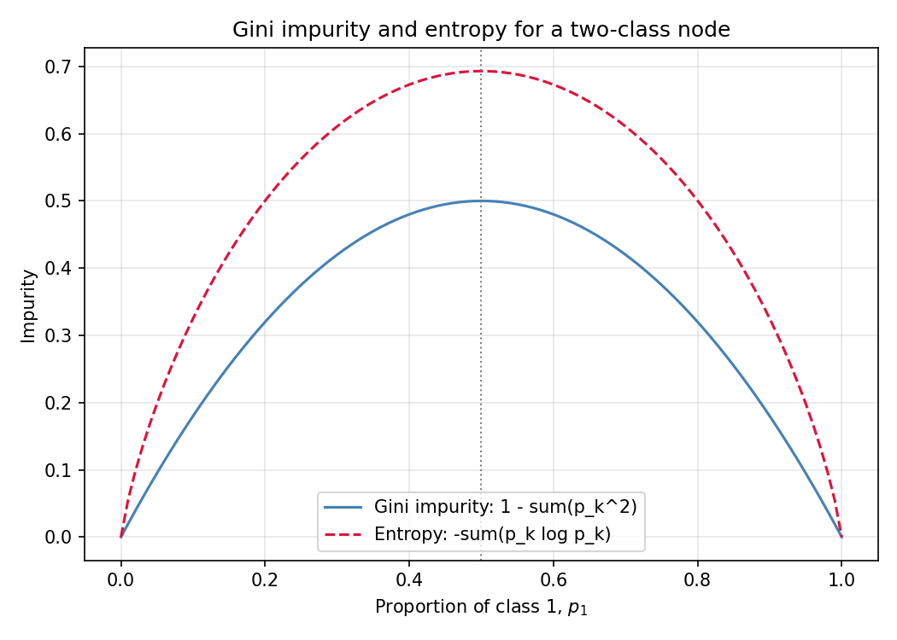
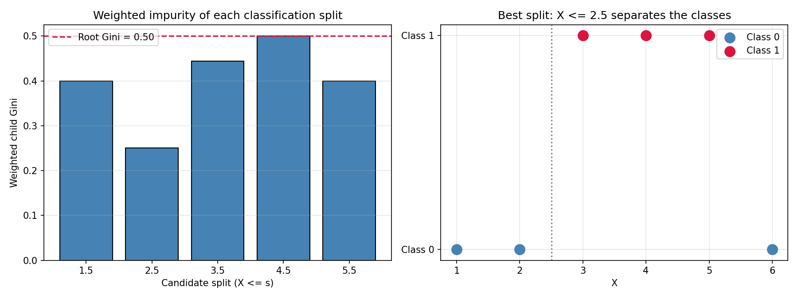
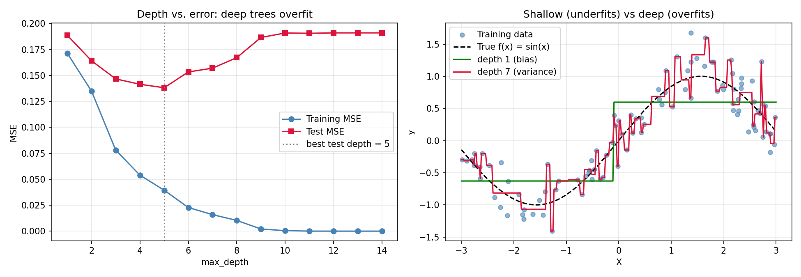
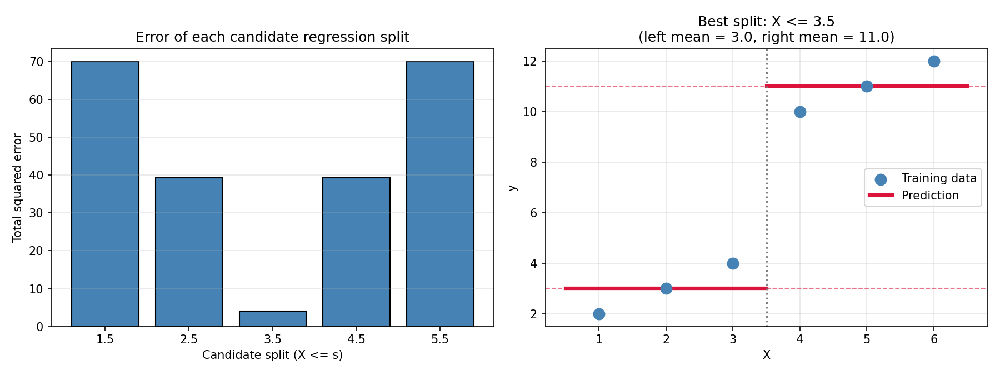
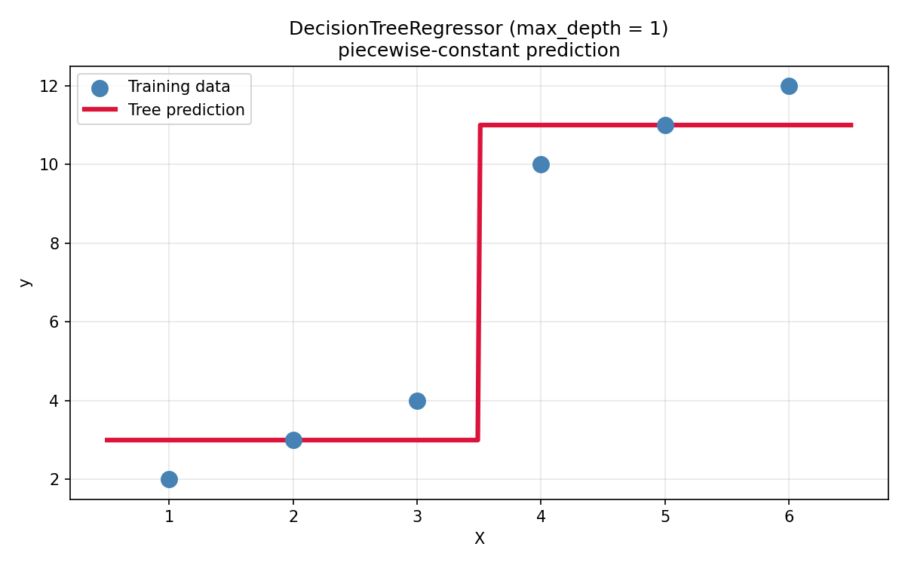
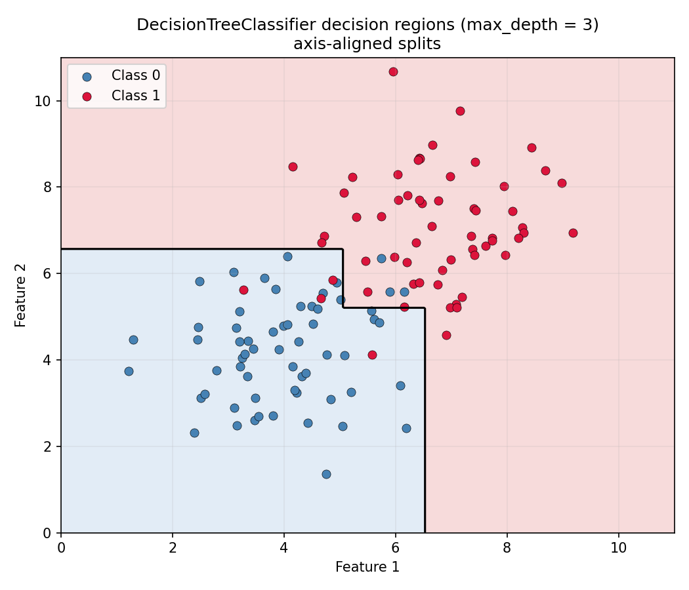

# Decision Trees & Information Theory

A practical, conversational guide to decision trees: what they are, how they learn, and how to build one from scratch in NumPy.

## Table of Contents

[**Part 1 — Introduction to Decision Trees**](#part-1)
1. [What is a Decision Tree?](#sec-1-1)
2. [A Simple Decision Tree Example](#sec-1-2)
3. [Anatomy of a Decision Tree](#sec-1-3)
4. [Why Are Decision Trees a Good AI/ML Choice?](#sec-1-4)
5. [Why Are Decision Trees Different from Linear Models?](#sec-1-5)
6. [The Two Main Types of Decision Trees](#sec-1-6)

[**Part 2 — Decision Tree Classification & Information Theory**](#part-2)
1. [What a Classification Tree Predicts](#sec-2-1)
2. [Majority Class and Class Probabilities](#sec-2-2)
3. [Pure vs. Impure Nodes](#sec-2-3)
4. [The Central Problem: Which Question Should the Tree Ask?](#sec-2-4)
5. [Information Theory: Measuring Uncertainty](#sec-2-5)

[**Part 3 — Entropy, Gini Impurity, and Information Gain**](#part-3)
1. [Entropy: The Expected Surprise, Made Concrete](#sec-3-1)
2. [Gini Impurity: The Misclassification Story](#sec-3-2)
3. [Entropy vs. Gini](#sec-3-3)
4. [Weighted Child Impurity](#sec-3-4)
5. [Information Gain](#sec-3-5)

[**Part 4 — Building the Tree**](#part-4)
1. [The Strategy: Recursive Binary Splitting](#sec-4-1)
2. [Why It's Greedy](#sec-4-2)
3. [Searching for the Best Split](#sec-4-3)
4. [The Tree in Python — One Example From the Code](#sec-4-4)
5. [Stopping Criteria](#sec-4-5)

[**Part 5 — Overfitting and Controlling Tree Size**](#part-5)
1. [What Overfitting Looks Like](#sec-5-1)
2. [The Bias-Variance Tradeoff](#sec-5-2)
3. [Early Stopping: Control the Tree While Building](#sec-5-3)
4. [Pruning: Grow First, Then Cut](#sec-5-4)
5. [Pruning vs. Early Stopping](#sec-5-5)

[**Part 6 — Regression Trees**](#part-6)
1. [Same Machine, Different Score](#sec-6-1)
2. [The Split Score for Regression](#sec-6-2)
3. [Worked Example](#sec-6-3)
4. [Regression vs. Classification: Side by Side](#sec-6-4)

[**Part 7 — Walkthroughs, Visualization, and scikit-learn**](#part-7)
1. [Tiny Dataset Walkthroughs](#sec-7-1)
2. [Visualization](#sec-7-2)
3. [The scikit-learn Version](#sec-7-3)

[**Part 8 — Decision Trees in Practice**](#part-8)
1. [Decision Trees vs. Linear and Logistic Regression](#sec-8-1)
2. [Advantages and Disadvantages](#sec-8-2)
3. [Hyperparameters at a Glance](#sec-8-3)
4. [Computational Considerations](#sec-8-4)
5. [Common Misconceptions](#sec-8-5)
6. [Connection to Ensemble Learning](#sec-8-6)
7. [Key Takeaways](#sec-8-7)
8. [References](#sec-8-8)

**Figures**
- [Figure 1 — `01_impurity_gini_entropy.png` — Part 3, Entropy vs. Gini](#figure-1)
- [Figure 2 — `03_best_split_classification.png` — Part 4, The Tree in Python](#figure-2)
- [Figure 3 — `06_depth_overfitting.png` — Part 5, The Bias-Variance Tradeoff](#figure-3)
- [Figure 4 — `02_best_split_regression.png` — Part 6, Worked Example](#figure-4)
- [Figure 5 — `04_regression_tree.png` — Part 7, Visualization](#figure-5)
- [Figure 6 — `05_classification_regions.png` — Part 7, Visualization](#figure-6)

---

<a id="part-1"></a>
# Part 1 — Introduction to Decision Trees

<a id="sec-1-1"></a>
## 1. What is a Decision Tree?

A Decision Tree is a model that makes predictions by asking a sequence of simple yes/no questions. Each question is about one feature, and the answer sends the data point down one path, question after question, until it reaches a final answer — the prediction.

Think of it like a flowchart, or a game of 20 questions: you start with one question, and depending on the answer you ask another, then another, until you have enough information to give a final answer.

That's the whole idea. No complicated math required to understand it — a decision tree is just if-else logic, structured as a tree.

<a id="sec-1-2"></a>
## 2. A Simple Decision Tree Example

Let's predict whether a customer will buy a product, using two features: `age` and `income`.

```
                Is Age > 30?
               /            \
             Yes              No
             /                  \
    Income > 50K?              Don't Buy
      /        \
    Yes         No
    /            \
  Buy        Don't Buy
```

Now let's send a few customers through the tree and watch how each one reaches a prediction.

**Customer 1: age 40, income 60K**
- Root: "Is Age > 30?" → Yes → move down the left branch.
- "Income > 50K?" → Yes (60K > 50K) → **Buy**.

**Customer 2: age 25, income 120K**
- Root: "Is Age > 30?" → No → straight to the right leaf → **Don't Buy**.
- The second question is never even asked. High income doesn't matter if the customer is young — this tree says so.

**Customer 3: age 35, income 30K**
- Root: "Is Age > 30?" → Yes → down the left branch.
- "Income > 50K?" → No (30K < 50K) → **Don't Buy**.

Every customer starts at the root, answers questions, and ends at a leaf. The leaf they land in is their prediction.

<a id="sec-1-3"></a>
## 3. Anatomy of a Decision Tree

Here's the same example tree with every part labeled:

```
                 ┌──────────────────┐
                 │   ROOT NODE      │  ← the first node, holds all the data
                 │  "Is Age > 30?"  │
                 └────────┬─────────┘
                    branch│
              ┌───────────┴───────────┐
           Yes│                       │No
              ▼                       ▼
     ┌──────────────────┐    ┌────────────────┐
     │  INTERNAL NODE   │    │   LEAF NODE    │
     │ "Income > 50K?"  │    │  "Don't Buy"   │  ← prediction
     └────────┬─────────┘    └────────────────┘
              │
         ┌────┴────┐
      Yes│         │No
         ▼         ▼
   ┌─────────┐ ┌─────────┐
   │  LEAF   │ │  LEAF   │
   │  "Buy"  │ │"Don't Buy"│
   └─────────┘ └─────────┘
```

Now, component by component, using this tree as the example:

| Component | Meaning | In our example |
|-----------|---------|----------------|
| **Root Node** | The topmost node. Every data point starts here. | `"Is Age > 30?"` |
| **Internal Node** | A node that asks a question and splits the data. | `"Income > 50K?"` |
| **Branch / Edge** | The connection between a parent node and its children. | The lines joining the nodes |
| **Leaf Node** | An end node with no questions. Holds the final prediction. | `"Buy"`, `"Don't Buy"` |
| **Split** | Dividing a node's data using one question. | Splitting on `age > 30` |
| **Feature** | The variable the question is about. | `age`, `income` |
| **Threshold** | The number a feature is compared to. | `30`, `50K` |
| **Prediction** | The final answer stored at a leaf. | `Buy` / `Don't Buy` |

The pattern is simple: one **root**, one or more **internal nodes** that ask questions, **branches** that connect them, and **leaves** at the bottom that hold predictions.

<a id="sec-1-4"></a>
## 4. Why Are Decision Trees a Good AI/ML Choice?

### Why Are Decision Trees a Good AI Choice?

- **They model nonlinear relationships.** If the relationship between features and the target isn't a straight line, a tree doesn't care — it just keeps splitting until the regions fit the data.
- **They naturally represent conditional logic.** If-else rules are how humans think and explain things, so the model's reasoning feels familiar.
- **They capture feature interactions.** In our example, income only matters for customers over 30. A tree discovers interactions like this on its own, without you engineering them.
- **They're easy to interpret.** A small tree can be explained to someone who has never heard of machine learning.
- **They make few assumptions.** Linear models assume things like linearity and normally distributed errors. A tree assumes almost nothing about the data.
- **They work for both classification and regression.** The same tree machinery handles a class label or a number.
- **They don't need feature scaling.** A threshold like "income > 50K" lives on the feature's own scale, so normalizing features isn't required.

<a id="sec-1-5"></a>
## 5. Why Are Decision Trees Different from Linear Models?

### Why Are Decision Trees Different from Linear Models?

A linear model tries to learn **one mathematical relationship** that describes the whole dataset:

```
y = β₀ + β₁x₁ + β₂x₂ + ...
```

One formula, applied everywhere. Every prediction comes out of the same equation.

A decision tree works differently — it doesn't fit a global formula at all. It divides the feature space into regions using sequential decisions:

```
if x₁ > threshold:      → region A, predict c₁
else:                   → region B, predict c₂
```

Inside each region, the tree uses a simple constant prediction. So instead of one smooth function covering everything, you get a **piecewise-constant** model: flat inside each region, jumping at the region boundaries.

The core difference in one line:

> Linear models learn one relationship across the whole feature space. Decision trees divide the feature space into regions, each with its own local rule.

<a id="sec-1-6"></a>
## 6. The Two Main Types of Decision Trees

Decision trees are mainly used for two supervised learning tasks:

1. **Decision Tree Classification**
2. **Decision Tree Regression**

### Classification

The target is a **categorical value** — a class.

Examples:

- Spam / Not Spam
- Disease / No Disease
- Cat / Dog
- Customer will buy / won't buy

The leaf produces a **class prediction**.

### Regression

The target is a **continuous numerical value**.

Examples:

- House price
- Temperature
- Salary
- Stock return

The leaf produces a **numerical prediction**.

The distinction is simple:

> **Classification → predicts a class/category.**
> **Regression → predicts a number.**

Everything else — the questions, the splits, the tree structure — is shared between the two. Only the split score and the leaf prediction change.

---

<a id="part-2"></a>
# Part 2 — Decision Tree Classification & Information Theory

<a id="sec-2-1"></a>
## 1. What a Classification Tree Predicts

A classification tree answers questions like "will this customer buy?" or "is this email spam?" — and its final answer is a **class label**.

Remember our buy/income tree from Part 1:

```
                Is Age > 30?
               /            \
             Yes              No
             /                  \
    Income > 50K?              Don't Buy
      /        \
    Yes         No
    /            \
  Buy        Don't Buy
```

The leaves hold the predictions: `Buy` or `Don't Buy`. Every data point that lands in a leaf gets that leaf's class.

But a classification tree can give you more than a class. It can also tell you **how confident** it is — that's the class probability.

<a id="sec-2-2"></a>
## 2. Majority Class and Class Probabilities

Where does a leaf's prediction come from? From the **training data** that landed in that leaf during training.

Say a leaf ends up with 10 training customers: 8 bought, 2 didn't.

- The **majority class** is `Buy` — that's the leaf's prediction.
- The **class proportions** are: 80% Buy, 20% Don't Buy — that's the leaf's class probability.

So a leaf stores both:

| Leaf content | Meaning |
|---|---|
| Majority class | The prediction (`Buy`) |
| Class proportions | The confidence behind it (80% Buy, 20% Don't Buy) |

When you ask the tree to predict a new customer, it returns `Buy`. When you ask for probabilities, it returns `[0.8 Buy, 0.2 Don't Buy]`.

> In scikit-learn terms: `predict()` gives you the class, `predict_proba()` gives you the probabilities.

The general rule: with $N$ observations in a leaf and $N_k$ of class $k$, the class proportion is

$$p_k = \frac{N_k}{N}$$

which is both the probability estimate and the basis for the majority-class prediction.

<a id="sec-2-3"></a>
## 3. Pure vs. Impure Nodes

Now think about what makes a leaf *good*. Compare three nodes with classes `Yes` and `No`:

```
Node A:  10 Yes,  0 No      → pure
Node B:   5 Yes,  5 No      → maximally mixed
Node C:   8 Yes,  2 No      → leaning
```

- **Node A is pure.** Every training point is `Yes`. The prediction is obvious and confident.
- **Node B is maximally mixed.** Fifty-fifty. Whatever we predict, half the points disagree. This is a coin flip.
- **Node C is in between.** Leaning `Yes`, but with some noise.

The pattern is intuitive: **a node that is pure makes easy, confident predictions; a node that is mixed makes coin-flip predictions.**

That's why the tree wants to split in a way that makes the child nodes **purer than the parent**. And to do that, it needs a way to answer one central question.

<a id="sec-2-4"></a>
## 4. The Central Problem: Which Question Should the Tree Ask?

At every node, the tree faces many candidate questions — one feature, many possible thresholds.

```
Is Age > 20?   Is Age > 30?   Is Age > 40?   ...
Is Income > 30K?   Is Income > 50K?   Is Income > 70K?   ...
```

Which one should it ask? We can't tell by looking — we need a **number** that measures how mixed a node is, so we can compare questions objectively.

> We need a score: "how mixed is this node?"

A good split turns a mixed parent into purer children. A bad split leaves everything as mixed as before. Once we have a number for "mixedness", the strategy is simple: try every candidate question, score the children it produces, and keep the question that leaves the children the purest.

That number — the impurity — comes straight from **information theory**. So before defining it, let's understand the idea it's built on.

<a id="sec-2-5"></a>
## 5. Information Theory: Measuring Uncertainty

### What "information" actually means

In everyday language, "information" is just facts or data. In information theory, it means something specific: **information is the reduction of uncertainty**. An event carries information when it surprises you — when you couldn't have predicted it.

Two examples:

- "The coin landed heads." — You knew it was 50/50. Mildly informative.
- "The coin landed on its edge." — That's extremely unlikely. Highly informative.

The rarer the event, the more information it carries. This is the key idea:

> The surprise of an event depends on how probable it was. Certain events carry zero information. Rare events carry a lot.

### Measuring information in bits

We measure information in **bits** — the number of yes/no questions you'd need to answer to figure something out.

- One fair coin flip: 1 bit. One yes/no question tells you the outcome.
- A roll of a fair 6-sided die: about 2.6 bits. You'd need between 2 and 3 yes/no questions to pin down the result — some outcomes need 2 questions, some need 3.

The connection: an event with probability $p$ carries roughly $\log_2(1/p)$ bits of surprise. A certain event ($p = 1$) carries $\log_2(1) = 0$ bits — no surprise at all. A fair coin flip ($p = 0.5$) carries $\log_2(2) = 1$ bit.

### Expected surprise: how uncertain are we on average?

Knowing the surprise of one event isn't enough — we want the **average surprise** of a whole situation: for each possible outcome, take its surprise and weight it by how likely it is.

Consider two coins:

- **Fair coin (50/50):** every outcome surprises us a full bit. Expected surprise ≈ 1 bit. Always uncertain.
- **Loaded coin (90% heads):** most of the time (90%) the result is heads — no surprise, 0 bits. Rarely (10%) it's tails — a big surprise. Expected surprise is small, because the predictable case dominates.

The intuition:

> The more mixed the situation, the higher the expected surprise. The more predictable, the lower it is.

That's precisely what we need for trees: a pure node has zero expected surprise. A fifty-fifty node has maximum expected surprise. A leaning node sits in between.

### Why information theory matters for decision trees

Here's the payoff. A **node** is just a situation with class probabilities — like a coin with multiple sides. Its "mixedness" *is* its expected surprise.

- Pure node → no surprise → prediction is certain.
- Mixed node → lots of surprise → prediction is a coin flip.

And when the tree splits a node into children, the children are (hopefully) less mixed — the class label becomes **less surprising**. The amount of surprise the split removed is literally the **information it gained**.

That's where the name "information gain" comes from, and it's exactly what we'll make precise next.

---

<a id="part-3"></a>
# Part 3 — Entropy, Gini Impurity, and Information Gain

In Part 2 we ended with the problem: the tree needs a **number** that measures how mixed a node is. Here it is — two standard measures, plus the split-scoring idea built on top of them: information gain.

<a id="sec-3-1"></a>
## 1. Entropy: The Expected Surprise, Made Concrete

In Part 2 we said "expected surprise". Entropy is exactly that, written as a formula:

$$H = -\sum_{k=1}^{K} p_k \log_2(p_k)$$

Where:

- $K$ — number of classes
- $p_k$ — proportion of class $k$ in the node ($\sum p_k = 1$)
- $\log_2$ — base-2 logarithm (so the result is in **bits**)
- the **minus sign** — needed because $\log_2(p_k)$ is negative for $p_k < 1$

The convention $0 \log 0 = 0$ applies: a class that never appears contributes no uncertainty.

Reading the formula: for each class, take its surprise $\log_2(1/p_k)$, and weight it by how likely that class is ($p_k$). Sum it up. That's the **average surprise** of the node.

### Calculating entropy by hand

Let's use the nodes from Part 2 and compute. Useful values: $\log_2(0.5) = -1$, $\log_2(0.8) \approx -0.32$, $\log_2(0.2) \approx -2.32$.

**Node A — pure:** $p = (1, 0)$

$$H = -(1 \cdot \log_2 1 + 0 \cdot \log_2 0) = -(0 + 0) = 0 \text{ bits}$$

No surprise at all — the class is certain.

**Node B — fifty-fifty:** $p = (0.5, 0.5)$

$$H = -\big(0.5(-1) + 0.5(-1)\big) = 1 \text{ bit}$$

Maximum uncertainty. A coin flip.

**Node C — leaning:** $p = (0.8, 0.2)$

$$H = -\big(0.8(-0.32) + 0.2(-2.32)\big) = 0.26 + 0.46 = 0.72 \text{ bits}$$

**90/10 node:** $p = (0.9, 0.1)$

$$H = -\big(0.9(-0.15) + 0.1(-3.32)\big) = 0.14 + 0.33 = 0.47 \text{ bits}$$

| Node | Proportions | Entropy (bits) |
|------|-------------|----------------|
| A | $p = (1, 0)$ | 0.00 |
| B | $p = (0.5, 0.5)$ | 1.00 |
| C | $p = (0.8, 0.2)$ | 0.72 |
| 90/10 | $p = (0.9, 0.1)$ | 0.47 |

Exactly the ordering our intuition predicted: pure → 0, evenly mixed → maximum, leaning → in between.

### The maximum

Entropy reaches its largest value when all classes are equally likely, $p_k = 1/K$:

$$H_\text{max} = \log_2 K$$

For two classes that's $\log_2 2 = 1$ bit. For three classes, $\log_2 3 \approx 1.585$ bits.

One practical note: the formula works with any logarithm base. Base 2 gives bits, base $e$ gives nats — they only differ by a constant factor, so **the choice of base never changes which split wins**. Code (including scikit-learn) often uses natural logs; the trees come out identical.

<a id="sec-3-2"></a>
## 2. Gini Impurity: The Misclassification Story

Gini impurity measures the same "how mixed" idea, but through a different story. Instead of surprise, it uses the **probability of a wrong random guess**.

Imagine you're in a node and you guess the class of a random observation by drawing a class at random, with the same probabilities as the node:

- The chance you draw class $k$ is $p_k$.
- The chance the observation really is class $k$ is also $p_k$.
- The chance the draw matches the truth for class $k$ is $p_k \cdot p_k = p_k^2$.
- Overall, the chance of a match is $\sum_k p_k^2$.

Gini impurity is the chance of a **mismatch**:

$$G = 1 - \sum_{k=1}^{K} p_k^2$$

An equivalent form, $G = \sum_k p_k(1 - p_k)$, says the same thing: for each class, $p_k$ is the chance you draw it and $1 - p_k$ is the chance the observation isn't it.

### Calculating Gini by hand

Same nodes as before.

**Node A — pure:** $p = (1, 0)$ → $G = 1 - (1^2 + 0^2) = 0$

**Node B — fifty-fifty:** $p = (0.5, 0.5)$ → $G = 1 - (0.25 + 0.25) = 0.5$

**Node C — leaning:** $p = (0.8, 0.2)$ → $G = 1 - (0.64 + 0.04) = 0.32$

**90/10 node:** $p = (0.9, 0.1)$ → $G = 1 - (0.81 + 0.01) = 0.18$

The maximum for $K$ classes, at the uniform distribution:

$$G_\text{max} = 1 - \frac{1}{K}$$

For two classes: $1/2$. For three: $2/3$.

<a id="sec-3-3"></a>
## 3. Entropy vs. Gini

Same nodes, both scores:

| Node | Proportions | Entropy (bits) | Gini |
|------|-------------|----------------|------|
| A | $p = (1, 0)$ | 0.00 | 0.00 |
| B | $p = (0.5, 0.5)$ | 1.00 | 0.50 |
| C | $p = (0.8, 0.2)$ | 0.72 | 0.32 |
| 90/10 | $p = (0.9, 0.1)$ | 0.47 | 0.18 |

They agree on the ranking — different formulas, same behavior. In practice:

- Both usually pick very similar splits.
- Gini tends to favor splits that push the majority proportion up faster.
- There's no strong theoretical argument for one over the other. Most problems: pick either, the trees come out close.

The same comparison, across every possible mix of two classes:

<a id="figure-1"></a>

*Figure 1 — Gini impurity and entropy for a two-class node as $p_1$ moves from 0 to 1. Both peak at the 50/50 mix and hit zero at a pure node.*

---
<a id="sec-3-4"></a>
## 4. Weighted Child Impurity

Now the split part. A split produces **two children**, each with its own impurity. The tree needs to combine them into **one number**.

The obvious idea — a plain average — is wrong. Why? **A child with more samples should matter more.** A split that puts 90 samples in a pure left child and 10 in a messy right child is mostly good; the messy child shouldn't count as much as the clean one.

So the tree weights each child by its share of the parent's samples:

$$Q_\text{children} = \frac{N_1}{N} Q_1 + \frac{N_2}{N} Q_2$$

Where $N$ is the parent's sample count, $N_1, N_2$ the children's, and $Q_1, Q_2$ their impurities.

### Worked example

Parent: 10 samples, 5 `Yes` 5 `No` → entropy $H_\text{parent} = 1$ bit.

A candidate split produces:

- **Left child:** 3 `Yes`, 3 `No` → $N_1 = 6$, $Q_1 = 1$ bit
- **Right child:** 4 `Yes`, 0 `No` → $N_2 = 4$, $Q_2 = 0$ (pure)

**Plain average (wrong):** $(1 + 0)/2 = 0.5$ — ignores that the left child holds most of the data.

**Weighted (what the tree uses):**

$$Q_\text{children} = \frac{6}{10}(1) + \frac{4}{10}(0) = 0.6$$

Higher than the plain average — correctly, since the larger, still-mixed child dominates.

<a id="sec-3-5"></a>
## 5. Information Gain

Now we can finally score a split. A split is good when its children are clearly purer than the parent. **Information gain is the difference**:

$$\text{Gain} = Q_\text{parent} - Q_\text{children} = Q_\text{parent} - \left(\frac{N_1}{N} Q_1 + \frac{N_2}{N} Q_2\right)$$

- With entropy, this is the classic **information gain**, in bits.
- With Gini, it's the same idea under a different name ("impurity reduction"). The mechanism is identical.

What it means in plain words: how much "mixedness" the split removed. Bigger gain → better split.

It's also exactly what the name suggests, tying back to Part 2: splitting reduces the surprise of the class label, and the amount removed is the information the split conveys about the class.

Two useful facts:

- **Gain is never negative.** Splitting can't make things more mixed. (Mathematically: entropy and Gini are concave, and a weighted average of concave functions never exceeds the function at the weighted average — that's Jensen's inequality.) A "useless" split has gain $= 0$, not negative.
- **The strategy:** try every candidate question, compute its gain, keep the largest.

### Worked example: scoring a split with Gini

Parent: **7 `Yes`, 3 `No`** → $p = (0.7, 0.3)$

$$G_\text{parent} = 1 - (0.49 + 0.09) = 0.42$$

A candidate split $X \le s$ routes the data:

- **Left child:** 6 `Yes`, 1 `No` → $p = (6/7, 1/7)$

$$G_1 = 1 - \left(\frac{36}{49} + \frac{1}{49}\right) = \frac{12}{49} \approx 0.2449$$

- **Right child:** 1 `Yes`, 2 `No` → $p = (1/3, 2/3)$

$$G_2 = 1 - \left(\frac{1}{9} + \frac{4}{9}\right) = \frac{4}{9} \approx 0.4444$$

**Weighted child impurity:**

$$Q_\text{children} = \frac{7}{10}(0.2449) + \frac{3}{10}(0.4444) = 0.1714 + 0.1333 = 0.3048$$

**Information gain:**

$$\text{Gain} = 0.42 - 0.3048 = 0.1152$$

The split reduced impurity from 0.42 to about 0.30 — a gain of ~0.115. With entropy instead of Gini the conclusion is the same (parent $H \approx 0.881$ bits, weighted children $\approx 0.690$ bits, gain $\approx 0.191$ bits).

### Comparing two candidate splits

Reuse the parent from Section 4: 10 samples, 5 `Yes` 5 `No`, $H_\text{parent} = 1$ bit.

**Split 1** (from Section 4): left 6 samples ($Q_1 = 1$), right 4 samples ($Q_2 = 0$).

$$Q_\text{children} = 0.6, \qquad \text{Gain} = 1 - 0.6 = 0.4 \text{ bits}$$

**Split 2** (a poorer split): left 5 samples (4 `Yes`, 1 `No`), right 5 samples (1 `Yes`, 4 `No`). Each child is $p = (0.8, 0.2)$, entropy $0.72$ bits.

$$Q_\text{children} = \frac{5}{10}(0.72) + \frac{5}{10}(0.72) = 0.72, \qquad \text{Gain} = 1 - 0.72 = 0.28 \text{ bits}$$

Split 1 wins: 0.4 > 0.28. That comparison — score every candidate question, keep the one with the largest gain — is exactly what the tree does at every node.

---

<a id="part-4"></a>
# Part 4 — Building the Tree

We have the scoring machinery from Part 3. Now the real question: how does the tree actually get built? This part covers the algorithm, then shows the actual Python code from the repo and follows it by hand on one example.

<a id="sec-4-1"></a>
## 1. The Strategy: Recursive Binary Splitting

The tree is built by one idea repeated: **split the data into two, then split each piece again, and keep going**. Each piece is handled exactly like the whole — that's recursion.

```
build_tree(data):
    if data should stop:      → make a leaf
    find the best split       → (feature, threshold) with largest gain
    split data into left, right
    build_tree(left)          → recursive call
    build_tree(right)         → recursive call
```

Concretely, the tree starts with the root holding everything. It asks: "what single question gives the largest gain?" It splits on that question, and then **each child repeats the same process on its own data**. Children become leaves when they're told to stop.

This is why it's called **recursive binary splitting**: every split is binary (two children), and the splitting is applied recursively.

<a id="sec-4-2"></a>
## 2. Why It's Greedy

Here's an honest limitation: the tree **doesn't search for the best possible overall tree**. That problem — find the optimal tree over all possible split sequences — is computationally intractable in practice.

Instead, the tree is **greedy**: at each node it picks the single best split *for that node's data*, with no lookahead.

> The tree chooses the best split available at the current node, even if a slightly worse split now would lead to a better tree later.

Is that a problem? Sometimes. But it's the standard approach used by every major library, and it works well in practice. Worth remembering: the result is a *good* tree, not necessarily the *optimal* one.

<a id="sec-4-3"></a>
## 3. Searching for the Best Split

To find the best split at a node, the tree checks **every feature and every candidate threshold**:

```
for each feature j:
    for each threshold s (between consecutive values of feature j):
        split the node's data on "X_j <= s"
        compute the weighted child impurity (Part 3)
        remember the best (j, s) so far
```

Two details worth noting:

- **Candidate thresholds** are the midpoints between consecutive distinct values of the feature. With values $1, 2, 3, 4, 5, 6$, the tree tries $1.5, 2.5, 3.5, 4.5, 5.5$. (Splitting at $2$ instead of $2.5$ gives the exact same partition — both send $1$ and $2$ left.)
- **The best split** is the one with the smallest weighted child impurity — equivalently, the largest information gain. The parent's impurity is fixed, so minimizing $Q_\text{children}$ and maximizing gain are the same thing.

The tree then splits the data, and each child runs this same search on its own slice of the data. Repeat until a stopping condition says stop.

---
<a id="sec-4-4"></a>
## 4. The Tree in Python — One Example From the Code

This is the actual logic from the repo's `05_decision_tree_classifier.py`, trimmed to its core. Read it once, then we'll follow it by hand on a tiny dataset.

### The code

```python
import numpy as np

def gini(probs):
    return 1.0 - np.sum(probs ** 2)                    # Part 3 formula

def weighted_impurity(left_y, right_y, n, n_classes):
    c1 = np.bincount(left_y, minlength=n_classes)      # class counts in left child
    c2 = np.bincount(right_y, minlength=n_classes)     # class counts in right child
    i1 = gini(c1 / c1.sum())                           # impurity of each child
    i2 = gini(c2 / c2.sum())
    return (len(left_y) / n) * i1 + (len(right_y) / n) * i2   # weighted (Part 3)

def best_split(X, y, n_classes):
    n_samples, n_features = X.shape
    best_Q = np.inf
    best = None
    for j in range(n_features):                        # 1. every feature
        values = np.sort(np.unique(X[:, j]))
        for k in range(1, len(values)):                # 2. every midpoint threshold
            s = (values[k - 1] + values[k]) / 2.0
            left  = y[X[:, j] <= s]                    # 3. split the classes
            right = y[X[:, j] >  s]
            Q = weighted_impurity(left, right, n_samples, n_classes)
            if Q < best_Q:                             # 4. keep the best
                best_Q = Q
                best = (j, s)
    return best                                        # (feature, threshold)

def build_tree(X, y, depth, max_depth, min_samples_split, n_classes):
    n = len(y)
    # STOP: too deep, too few samples, or already pure → make a leaf
    if depth >= max_depth or n < min_samples_split or len(np.unique(y)) == 1:
        return Leaf(y, n_classes)
    best = best_split(X, y, n_classes)
    if best is None:                                   # no useful split found
        return Leaf(y, n_classes)
    j, s = best
    left_idx = X[:, j] <= s
    return InternalNode(j, s,                          # recursive case
        build_tree(X[left_idx],  y[left_idx],  depth + 1, max_depth, min_samples_split, n_classes),
        build_tree(X[~left_idx], y[~left_idx], depth + 1, max_depth, min_samples_split, n_classes))
```

The pieces map to the theory:

- `gini` and `weighted_impurity` — the scoring from Part 3, verbatim.
- `best_split` — the search from Section 3: all features, all midpoint thresholds, keep the smallest weighted impurity.
- `build_tree` — recursion from Section 1: stop → leaf, otherwise split and call itself on each child.
- `Leaf` stores the class counts, proportions, and majority class (Part 2). `InternalNode` stores the feature, threshold, and two children.

### Following the code by hand

Now the moment of truth: run this on the tiny dataset from the repo's own demo —

$$X = [1, 2, 3, 4, 5, 6], \qquad y = [0, 0, 1, 1, 1, 0]$$

**Step 1 — the root.** `build_tree(X, y, depth=0)` checks the stopping conditions: depth 0 < max_depth, 6 samples ≥ min_samples_split, and the labels aren't pure (3 zeros, 3 ones). So it calls `best_split`.

**Step 2 — the search.** One feature, values $[1,2,3,4,5,6]$, five midpoint thresholds. For each one we split and compute the weighted Gini:

| Threshold | Left child | Right child | Weighted impurity $Q$ |
|-----------|-----------|-------------|------------------------|
| $1.5$ | [0] | [0,1,1,1,0] | $\frac{1}{6}(0) + \frac{5}{6}(0.32) \approx 0.27$ |
| $2.5$ | [0,0] | [1,1,1,0] | $\frac{2}{6}(0) + \frac{4}{6}(0.375) = 0.25$ ✅ |
| $3.5$ | [0,0,1] | [1,1,0] | $0.44$ |
| $4.5$ | [0,0,1,1] | [1,0] | $0.50$ |
| $5.5$ | [0,0,1,1,1] | [0] | $\approx 0.40$ |

The winner is **$X \le 2.5$** with $Q = 0.25$. The parent's Gini was $0.5$ (3 zeros vs 3 ones), so the gain is $0.5 - 0.25 = 0.25$ — the best available.

**Step 3 — recursion.** The tree splits into left `{1,2}` and right `{3,4,5,6}` and calls `build_tree` on each, now at `depth=1`.

- **Left child:** labels [0,0] — pure. Stopping condition hit → `Leaf`, majority class 0, probabilities [1.0, 0.0].
- **Right child:** labels [1,1,1,0] — 3 ones vs 1 zero, not pure. With `max_depth=1` (the repo's demo setting) the depth condition stops it → `Leaf`, majority class 1, probabilities [0.25, 0.75].

**Step 4 — done.** The tree:

```
X <= 2.5 ?
├── Yes → class 0   (P(class 1) = 0.00)
└── No  → class 1   (P(class 1) = 0.75)
```

### Making predictions

Predicting is just walking the tree:

```python
def predict_one(node, x):
    if node.is_leaf:
        return node.prediction
    if x[node.feature] <= node.threshold:
        return predict_one(node.left, x)
    return predict_one(node.right, x)
```

New point $X = 4$: at the root, $4 \le 2.5$? No → right leaf → class 1. New point $X = 2$: $2 \le 2.5$? Yes → left leaf → class 0. The recursion here is the same idea as building, just in reverse: instead of splitting data down, we push the point down.

Run `05_decision_tree_classifier.py` and you'll see exactly these predictions printed.

The split search, visualized — each candidate threshold's weighted Gini on the left, the winning threshold against the classes on the right:

<a id="figure-2"></a>

*Figure 2 — Left: weighted child Gini of every candidate split (dashed line: root impurity, 0.50). Right: the best threshold $X \le 2.5$ splits class 0 from class 1.*

<a id="sec-4-5"></a>
## 5. Stopping Criteria

Why does the tree ever stop? Because if it never did, it would split until every leaf holds one training point — perfect training accuracy, terrible generalization. That's overfitting, and it's the topic of Part 5.

The standard stop conditions:

| Condition | Meaning |
|-----------|---------|
| `max_depth` | Don't grow deeper than this many splits. |
| `min_samples_split` | A node must have at least this many samples to split. |
| `min_samples_leaf` | Reject a split that would create a child smaller than this. |
| `max_leaf_nodes` | Stop once the tree has this many leaves. |
| Pure node | All one class — no split can improve anything. |
| No useful split | Best gain is 0 (or no threshold available) — splitting does nothing. |

These are the knobs that control **tree complexity**: more splits → bigger tree → lower training error → more overfitting risk. Fewer splits → smaller tree → higher bias.

---

<a id="part-5"></a>
# Part 5 — Overfitting and Controlling Tree Size

The algorithm from Part 4 builds a tree. Left to itself, it would keep splitting until every leaf is pure — and that's exactly the problem. This part is about why that's bad, and the two ways to stop it.

<a id="sec-5-1"></a>
## 1. What Overfitting Looks Like

Give a tree no stopping conditions and it will split until each leaf holds training points of one class. Every training point is essentially its own region. Training error drops to (almost) zero.

The catch: those tiny regions encode **noise, not signal**. On unseen data they predict badly, because the tree has memorized the training set rather than learned the pattern.

This is the classic overfitting story: near-zero training error, high test error.

<a id="sec-5-2"></a>
## 2. The Bias-Variance Tradeoff

In the linear regression material we decomposed test error as:

$$\text{Test Error} = \text{Bias}^2 + \text{Variance} + \text{Irreducible Error}$$

Trees illustrate this sharply:

- **Shallow tree** → simpler model → high bias (underfits) → low variance.
- **Deep tree** → complex model → low training error → high variance (overfits).

Trees are notoriously **high variance** models: a small change in the training data can change the whole tree, because a slightly different top split ripples through every descendant. So the tradeoff for trees is more extreme than for most models — which is exactly why complexity control matters so much, and why Part 8's ensembles average many trees.

The goal is the middle ground: deep enough to capture the pattern, shallow enough not to memorize the noise. The stopping knobs and pruning are how you find it.

The classic picture — grown on noisy sine data by the repo's `06_depth_overfitting.py`:

<a id="figure-3"></a>

*Figure 3 — Left: training error collapses while test error bottoms out and then rises as max_depth grows — deep trees overfit (dashed line: best test depth). Right: a depth-1 fit (high bias) vs. a depth-7 fit (high variance) on noisy sine data.*

<a id="sec-5-3"></a>
## 3. Early Stopping: Control the Tree While Building

The simplest control happens *during* construction. These are the same conditions from Part 4, now as tuning tools:

| Knob | What it does | Raise it | Lower it |
|------|--------------|----------|----------|
| `max_depth` | Caps tree height | smaller tree, less overfitting | deeper tree, more overfitting |
| `min_samples_split` | Minimum samples to allow a split | fewer nodes split | more nodes split |
| `min_samples_leaf` | Minimum size of any child leaf | smoother, smaller tree | tiny leaves, choppy tree |
| `max_leaf_nodes` | Caps total number of leaves | simpler, higher-bias fit | more regions, complex fit |

Rule of thumb: a small `max_depth` is the simplest way to keep a tree from memorizing individual points.

<a id="sec-5-4"></a>
## 4. Pruning: Grow First, Then Cut

Early stopping decides *before* the deep branches exist. **Pruning** works the other way: grow the tree fully, then remove branches afterward.

> A fully grown tree describes noise in the training data. Pruning removes unnecessary branches to get a simpler subtree.

The principled version is **cost-complexity pruning**. It adds a penalty for tree size to the training error:

$$R_\alpha(T) = R(T) + \alpha |T|$$

Where:

- $T$ — the tree (a subtree of the fully grown one)
- $R(T)$ — training error of $T$ (misclassification rate or impurity)
- $|T|$ — number of leaves — the tree's complexity
- $\alpha \ge 0$ — how strongly complexity is penalized

Small $\alpha$ → weak penalty → large tree. Large $\alpha$ → strong penalty → small tree. Two anchors:

- $\alpha = 0$ → the fully grown tree wins (no penalty).
- $\alpha \to \infty$ → a single leaf wins (any split costs more than it's worth).

In practice, $\alpha$ is chosen by **cross-validation**: for each candidate $\alpha$, prune to the best subtree, measure validation performance, keep the $\alpha$ that does best. In scikit-learn this is `ccp_alpha` (with `cost_complexity_pruning_path` to explore values).

<a id="sec-5-5"></a>
## 5. Pruning vs. Early Stopping

Both fight overfitting by shrinking the tree; they just act at different times:

| | Early stopping | Pruning |
|---|---|---|
| When | During construction | After full growth |
| Information | Can't see future branches | Sees the whole tree |
| Typical tools | `max_depth`, `min_samples_*` | `ccp_alpha` |

Neither is inherently better — but pruning has one advantage: it decides based on the *complete* tree, so it can see exactly what removing a branch costs.

---

<a id="part-6"></a>
# Part 6 — Regression Trees

Part 1 promised two types of trees. Classification got Parts 2–5. Now the second: regression trees, where the target is a number, not a class.

<a id="sec-6-1"></a>
## 1. Same Machine, Different Score

Everything about the algorithm is unchanged — the questions, the thresholds, the recursion, the stopping rules. Two things differ:

1. **Split score** — instead of impurity, regression uses **squared error**.
2. **Leaf prediction** — instead of majority class, regression stores the **mean** of the leaf's target values (derived in Part 1, Section 6).

<a id="sec-6-2"></a>
## 2. The Split Score for Regression

For classification, "how mixed is this node" meant "how mixed are the classes". For regression, the response is a number, so "mixed" means something else: **how much do the $y$-values vary around their mean?**

The measure is the squared error:

$$\text{SSE} = \sum_{i} (y_i - \bar{y})^2$$

And the split score is the sum of the two children's errors:

$$Q_\text{children} = \sum_{i \in R_1} (y_i - \hat c_1)^2 + \sum_{i \in R_2} (y_i - \hat c_2)^2$$

where $\hat c_1, \hat c_2$ are the children's means (their would-be leaf predictions). The best split is the one with the smallest total error — exactly the "smallest weighted impurity" idea from Part 3, with squared error in place of Gini.

A useful equivalent: since $\sum (y_i - \bar y)^2 = n \cdot \text{Var}(y)$, minimizing the split error is the same as minimizing the **within-child variance**. "Make each child as tight around its mean as possible."

<a id="sec-6-3"></a>
## 3. Worked Example

One feature $X$, one response $y$:

| $i$ | $X$ | $y$ |
|-----|-----|-----|
| 1 | 1 | 2 |
| 2 | 2 | 3 |
| 3 | 3 | 4 |
| 4 | 4 | 10 |
| 5 | 5 | 11 |
| 6 | 6 | 12 |

The first three $y$'s are small, the last three are large. A good split should separate them.

Candidate thresholds (midpoints): $1.5, 2.5, 3.5, 4.5, 5.5$. For each, split the data, take each side's mean, and add the squared errors.

**$X \le 1.5$:** left $\{2\}$ (error 0); right $\{3,4,10,11,12\}$, mean 8, error $(3-8)^2+(4-8)^2+(10-8)^2+(11-8)^2+(12-8)^2 = 70$. **Total: 70.**

**$X \le 2.5$:** left $\{2,3\}$, mean 2.5, error 0.5; right $\{4,10,11,12\}$, mean 9.25, error 38.75. **Total: 39.25.**

**$X \le 3.5$:** left $\{2,3,4\}$, mean 3, error 2; right $\{10,11,12\}$, mean 11, error 2. **Total: 4.** ✅

**$X \le 4.5$:** left mean 4.75 (error 38.75); right mean 11.5 (error 0.5). **Total: 39.25.**

**$X \le 5.5$:** left mean 6 (error 70); right $\{12\}$ (error 0). **Total: 70.**

| Split | Total squared error |
|-------|---------------------|
| $X \le 1.5$ | 70.00 |
| $X \le 2.5$ | 39.25 |
| $X \le 3.5$ | **4.00** |
| $X \le 4.5$ | 39.25 |
| $X \le 5.5$ | 70.00 |

The winner is **$X \le 3.5$** — it separates the low region from the high region, exactly the structure visible in the data.

The same search, visually — each candidate's total error on the left, the winning fit on the right:

<a id="figure-4"></a>

*Figure 4 — Left: total squared error of every candidate split; $X \le 3.5$ is the clear minimum. Right: the winning piecewise-constant prediction — mean 3 up to the threshold, mean 11 after.*

After the split, recursion continues on each child: the right child $\{10,11,12\}$ could be split again, and so on, until a stopping condition fires. With `max_depth=1` (the repo's `04_decision_tree_regressor.py` demo), the leaves are: left predicts mean$(2,3,4) = 3$, right predicts mean$(10,11,12) = 11$.

A plot of this fit is a **staircase**: constant 3 up to $X = 3.5$, then jumping to 11 — piecewise-constant prediction (Part 1, Section 4) in action.

<a id="sec-6-4"></a>
## 4. Regression vs. Classification: Side by Side

| | Classification tree | Regression tree |
|---|---|---|
| Target | Class / category | Continuous number |
| Split score | Weighted impurity (Gini / entropy) | Squared error (SSE) |
| Leaf prediction | Majority class (+ probabilities) | Mean of the leaf's $y$'s |
| Prediction output | Class label / probabilities | A number |

Same search, same recursion, same stopping rules. Only the score and the leaf rule change.

The regression code mirrors the classification code exactly — the repo's `04_decision_tree_regressor.py` swaps `weighted_impurity` for `squared_error` in `best_split`, and `Leaf` stores `np.mean(y)` instead of the majority class. Everything else is identical.

---

<a id="part-7"></a>
# Part 7 — Walkthroughs, Visualization, and scikit-learn

This part makes everything concrete: full hand-checkable walkthroughs of both tiny datasets, what the fitted trees actually look like, and how the from-scratch version lines up with scikit-learn.

<a id="sec-7-1"></a>
## 1. Tiny Dataset Walkthroughs

### 1.1 Regression walkthrough

The data from Part 6: $X = [1,2,3,4,5,6]$, $y = [2,3,4,10,11,12]$.

1. **Start:** all 6 observations at the root.
2. **Candidate splits:** $X \le 1.5, 2.5, 3.5, 4.5, 5.5$.
3. **Split errors:** $70.00, 39.25, 4.00, 39.25, 70.00$.
4. **Best split:** $X \le 3.5$ (error 4).
5. **Recursion:** the right child $\{4,5,6\}$ (targets $[10,11,12]$) could still be split, but `max_depth=1` stops here.
6. **Leaves:** left → mean$(2,3,4) = 3$; right → mean$(10,11,12) = 11$.
7. **Predictions:** any $X \le 3.5$ → 3; any $X > 3.5$ → 11.

Check the leaf means by hand: $(2+3+4)/3 = 3$ and $(10+11+12)/3 = 11$. Run `04_decision_tree_regressor.py` and it prints exactly this.

### 1.2 Classification walkthrough

The data from Part 4: $X = [1,2,3,4,5,6]$, classes $= [0,0,1,1,1,0]$.

1. **Root:** 3 zeros, 3 ones → $p = (0.5, 0.5)$, $G = 0.5$.
2. **Candidate splits:** midpoints $1.5, 2.5, 3.5, 4.5, 5.5$.
3. **$X \le 2.5$:** left $\{1,2\}$ → 2 zeros, 0 ones ($G_1 = 0$); right $\{3,4,5,6\}$ → 1 zero, 3 ones ($p = (0.25, 0.75)$, $G_2 = 0.375$). Weighted: $\frac{2}{6}(0) + \frac{4}{6}(0.375) = 0.25$. Gain $= 0.5 - 0.25 = 0.25$.
4. **$X \le 3.5$:** both children $p = (2/3, 1/3)$, $G \approx 0.444$. Weighted: $0.444$. Gain $\approx 0.056$.
5. **Best split:** $X \le 2.5$ (lowest weighted impurity, 0.25).
6. **Recursion:** the right child $\{3,4,5,6\}$ could be split further; `max_depth=1` stops.
7. **Leaves:** left → class 0 (2 zeros, 0 ones); right → class 1 (3 ones vs 1 zero), $P(\text{class 1}) = 0.75$.
8. **Predictions:** $X \le 2.5$ → class 0; $X > 2.5$ → class 1.

Both walkthroughs are the exact workflows in the repo's demo scripts.

<a id="sec-7-2"></a>
## 2. Visualization

The plots make the piecewise-constant nature obvious.

**Regression** (`04_regression_tree.png`): the training points are drawn, and the tree's prediction is overlaid — a horizontal segment at each leaf's mean, jumping at the split threshold. It's literally a staircase.

**Classification** (`05_classification_regions.png`): a 2D dataset is colored by the tree's predicted class across the whole plane. The boundary between colors is the tree's decision regions.

One thing to notice in both plots: **all boundaries are axis-aligned**. Every split is "$X_j \le s$" on a single feature, so every boundary is a vertical or horizontal line, and every region is a rectangle. This is the axis-aligned property from Part 1, and it's both a strength (interpretability) and a weakness (Part 8).

<a id="figure-5"></a>

*Figure 5 — The fitted regression tree (solid crimson) is a staircase: constant within each region, jumping at $X = 3.5$. Blue points are the training observations.*

<a id="figure-6"></a>

*Figure 6 — Axis-aligned decision regions of a shallow classifier on a 2D dataset. Every boundary is vertical or horizontal.*

---
<a id="sec-7-3"></a>
## 3. The scikit-learn Version

Everything we built exists in scikit-learn, one import away:

```python
from sklearn.tree import DecisionTreeRegressor
from sklearn.tree import DecisionTreeClassifier
```

The library implements **the same algorithm** we've been building:

- greedy recursive binary splitting with midpoint-style threshold search,
- `squared_error` for regression, `gini` / `entropy` for classification,
- the same stopping parameters (`max_depth`, `min_samples_split`, `min_samples_leaf`, `max_leaf_nodes`),
- cost-complexity pruning via `ccp_alpha`,
- `predict()` and, for the classifier, `predict_proba()`.

Every concept maps one-to-one. But the implementation inside is very different from our educational version:

| Aspect | Our implementation | scikit-learn |
|--------|--------------------|--------------|
| Data structure | Python objects (nodes) | Compiled C arrays, Cython CART |
| Threshold search | Naïve scan of all midpoints | Optimized, presorted splits |
| Extras | None | Sample/class weights, `max_features`, missing-value support, pruning path |
| Speed | Fine for teaching | Designed for production |

So the right mental model: **our code teaches the algorithm; the library uses it at scale.** For full API behavior, the scikit-learn docs are the reference.

---

<a id="part-8"></a>
# Part 8 — Decision Trees in Practice

The final part zooms out: where trees fit among other models, their real strengths and weaknesses, and how they power the ensembles you'll meet next.

<a id="sec-8-1"></a>
## 1. Decision Trees vs. Linear and Logistic Regression

| Property | Linear Regression | Logistic Regression | Decision Tree |
|----------|-------------------|----------------------|---------------|
| Main task | Regression | Classification | Both |
| Prediction structure | Linear function | Log-odds, linear inside | Piecewise-constant regions |
| Nonlinear patterns | Need feature engineering | Need feature engineering | Natural |
| Feature scaling | Often useful | Often useful | Unnecessary |
| Interactions | Need explicit terms | Need explicit terms | Discovered automatically |
| Interpretability | High | High | High for small trees |
| Overfitting control | Regularization | Regularization | Depth, sample limits, pruning |

The differences come from how each represents $f(X)$:

- **Linear regression** assumes $f$ is linear; it needs explicit polynomial or interaction terms for anything else.
- **Logistic regression** assumes the log-odds are linear — same global, parametric philosophy.
- **Decision trees** assume nothing global. They approximate $f$ locally, which is why nonlinearity and interactions come for free, and why scaling doesn't matter (a threshold lives on its feature's own scale).

The tradeoff: linear models are smooth, efficient, and give you a global coefficient to reason about. Trees are flexible but choppy and — as Part 5 showed — easy to overfit.

<a id="sec-8-2"></a>
## 2. Advantages and Disadvantages

### Advantages

- **Easy to understand and interpret** — a small tree reads as if-then rules; any prediction can be explained by its path from root to leaf.
- **Easy to visualize** — the whole model can be drawn.
- **Little preprocessing** — no scaling, no engineered interactions.
- **Nonlinear patterns and interactions** come naturally.
- **One algorithm, two tasks** — classification and regression share the same machinery.

### Disadvantages

- **High variance** — a small change in the training data can change the whole tree.
- **Prone to overfitting** — without control (stopping or pruning), it memorizes the training set.
- **Axis-aligned splits can be restrictive** — diagonal boundaries need many splits to approximate, inflating the tree.
- **Often less accurate than ensembles** — a single tree usually loses to bagging, random forests, and boosting.

Each disadvantage traces to a mechanism we covered: variance from greedy recursion, overfitting from unlimited depth, axis-alignment from single-feature thresholds.

<a id="sec-8-3"></a>
## 3. Hyperparameters at a Glance

Quick reference for the knobs that control the tree:

| Parameter | What it controls |
|-----------|------------------|
| `max_depth` | Maximum tree height — the strongest single complexity control. |
| `min_samples_split` | Minimum samples required to allow a node to split. |
| `min_samples_leaf` | Minimum size of any leaf; rejects splits that create tiny children. |
| `max_leaf_nodes` | Caps the total number of leaves. |
| `criterion` | The split score — `gini` / `entropy` for classification, `squared_error` for regression. |
| `ccp_alpha` | Cost-complexity penalty for pruning after growth (Part 5). |

The first five act *during* construction (early stopping); `ccp_alpha` acts *after* (pruning). All of them tune the bias-variance tradeoff by changing tree size.

---
<a id="sec-8-4"></a>
## 4. Computational Considerations

Finding the best split is the expensive part. At every node the tree may have to examine:

- all $p$ features,
- all candidate thresholds per feature,
- all samples in the node to compute the score.

Our educational implementation rescans the node's samples for every threshold:

```
for each node:
    for each feature:
        for each candidate threshold:
            compute the score over the node's samples
```

Fine for teaching datasets, slow at scale. Production libraries speed this up by presorting features, updating counts incrementally as the threshold slides, and compiling the inner loops in C/Cython. Same algorithm, different engineering.

<a id="sec-8-5"></a>
## 5. Common Misconceptions

**"Decision trees need feature scaling."**
No. A split compares one feature to a threshold on that feature's own scale. Rescaling just rescales the threshold; the split quality is unchanged.

**"A deeper tree is always better."**
False. Deeper trees overfit (Part 5). The best performance is usually at some intermediate depth.

**"Zero training error means the model is good."**
No — a tree that memorizes training points hits zero training error precisely because it overfits. Judge it on held-out data.

**"Decision trees only work for classification."**
False. Regression trees predict numbers (Part 6); `DecisionTreeRegressor` is a regression tree.

**"Gini impurity and the Gini coefficient are the same."**
Different quantities, same name. Gini impurity ($1 - \sum p_k^2$) measures class mixture in a node. The Gini coefficient measures statistical dispersion (e.g., income inequality). Don't confuse them.

**"Decision trees search every possible tree."**
No. They use greedy recursive splitting (Part 4): locally best split at each node, never the whole space of trees.

**"Pruning and early stopping are the same."**
They're different mechanisms (Part 5): early stopping acts during construction; pruning removes branches after full growth.

<a id="sec-8-6"></a>
## 6. Connection to Ensemble Learning

A single tree has high variance — the central weakness from Section 2. Ensemble methods turn that weakness into strength by combining many trees:

```
Decision Tree → Bagging → Random Forest → Boosting
```

- **Bagging** trains many trees on resampled data and averages their predictions — cutting variance.
- **Random Forests** bag trees *and* randomize the features available at each split, decorrelating them further.
- **Boosting** trains trees sequentially, each one focusing on the previous trees' mistakes — cutting bias.

The shared idea: many weak, high-variance trees combined generalize far better than any single tree. That's exactly why decision trees matter even when a single tree underperforms an ensemble — and why they're studied first. These methods are their own chapters next; all you need now is the connection: **random forests and boosting build on decision trees.**

<a id="sec-8-7"></a>
## 7. Key Takeaways

- A **decision tree** partitions the feature space into regions and predicts with a constant per region: mean (regression) or majority class (classification).
- Every question is **one feature vs. one threshold** — "Is $X_j \le s$?"
- Splitting recursively makes nodes **purer**; mixed nodes are a coin flip, pure nodes are certain.
- **Entropy** measures a node's mixedness as expected surprise, in bits: $-\sum p_k \log_2 p_k$.
- **Gini impurity** measures it as the chance of a wrong random guess: $1 - \sum p_k^2$.
- **Weighted child impurity** combines the two children, weighted by sample counts.
- **Information gain** = parent impurity − weighted child impurity; the tree keeps the split with the largest gain.
- The tree is built **greedily and recursively**: best split here, no global search.
- Growth is controlled by **stopping** (depth/sample limits) and **pruning** ($R_\alpha(T) = R(T) + \alpha|T|$).
- Deep trees **overfit**; that's the bias-variance tradeoff in its sharpest form.
- Boundaries are **axis-aligned** — vertical/horizontal lines, rectangular regions.
- A single tree is often weaker than **ensembles** — which is exactly why bagging, random forests, and boosting exist.

<a id="sec-8-8"></a>
## 8. References

- James, G., Witten, D., Hastie, T., Tibshirani, R., & Taylor, J. (2023). *An Introduction to Statistical Learning with Applications in Python* (1st ed.). Springer. — ISLP Chapter 9: Tree-Based Methods.
- Hastie, T., Tibshirani, R., & Friedman, J. (2009). *The Elements of Statistical Learning: Data Mining, Inference, and Prediction* (2nd ed.). Springer. — ESL Chapter 10: Additive Models, Trees, and Related Methods; Chapter 11: Boosting and Additive Trees; Chapter 16: Random Forests.
- scikit-learn developers. *Decision Trees* documentation. https://scikit-learn.org/stable/modules/tree.html

---
